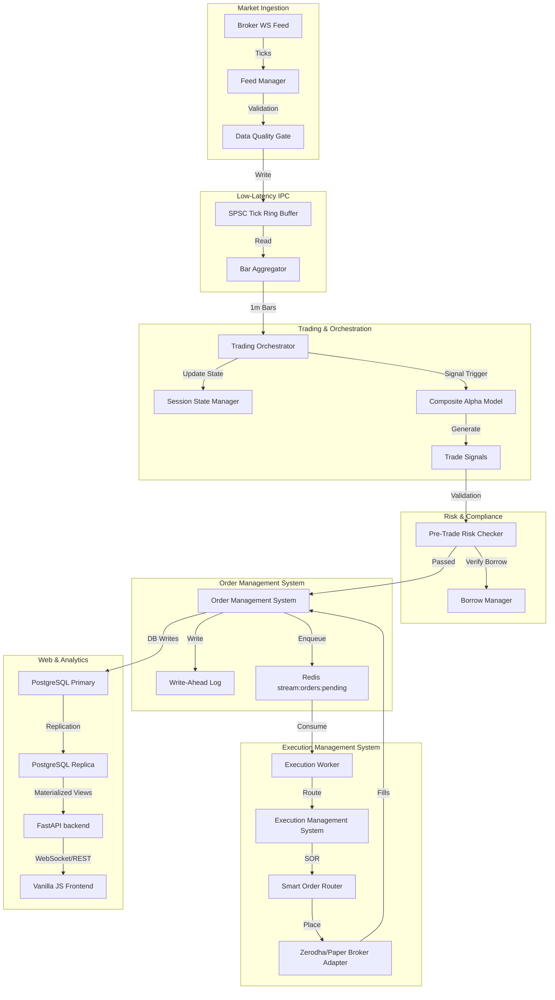
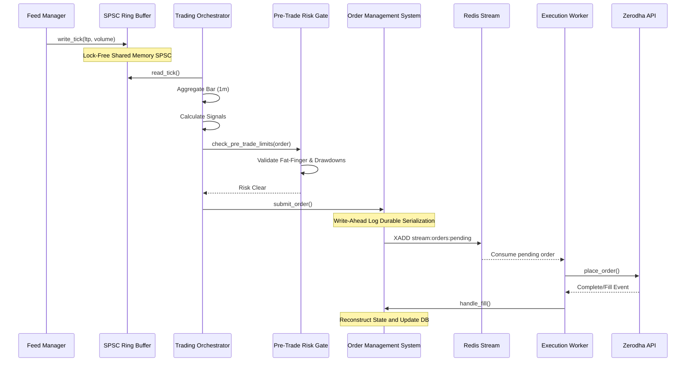
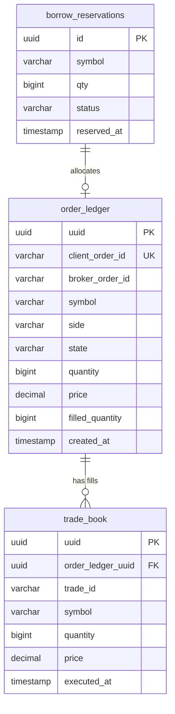

# Institutional Quantitative Trading Platform

An institutional-grade quantitative trading platform designed for high-performance, deterministic execution, and rigorous risk management in the Indian market (NSE/BSE).

---

## 1. Project Overview

The platform is designed around a decoupled, unidirectional event-driven architecture, implementing **Command Query Responsibility Segregation (CQRS)** to isolate critical execution paths from analytical queries. It supports real-time market data ingestion via WebSockets, online signal calculation, unsupervised market regime detection (via Hidden Markov Models/Gaussian Mixture Models), and smart order routing (SOR) with multi-broker support.

### Key Capabilities:
- **Low-Latency Inter-Process Communication (IPC)**: Utilizing shared memory lock-free Single-Producer Single-Consumer (SPSC) ring buffers to bypass OS-level locks.
- **Durable Write-Ahead Logging (WAL)**: Double-persist state serialization before placing orders to ensure zero state loss during crash recovery.
- **Fail-Safe Pre-Trade Checks**: Automated validation for price deviation, fat-finger size limits, daily drawdown limits, and strict borrow checks for short-selling.
- **CQRS Database Architecture**: Split reads (replica PostgreSQL database views and local analytical DuckDB files) from writes (primary PostgreSQL transactional tables).
- **FastAPI Backend & Dashboard UI**: Sleek, glassmorphic UI displaying real-time metrics, indexes, sector performances, active positions, and prediction calibrators.

---

## 2. Repository Structure

The repository has recently undergone a major package restructuring to migrate from a flat root layout to a Domain-Driven Package layout. 

### Restructuring Details
- **Deleted/Legacy Root Directories** (e.g., `trading_engine/`, `data_infra/`, `risk/`, `research/`, `execution/`, `features/`, `models/`, `monitoring/`): These have been marked deleted in Git and replaced by structured package modules.
- **Current Production Modules**:
  - `portfolio_execution/`: Replaces legacy `trading_engine/` and `execution/`. Contains core OMS, EMS, routing, and signal orchestrators.
  - `data_platform/`: Replaces legacy `data_infra/` and `features/`. Contains WebSocket feeds, data pipelines, feature store, validation rules, and ring buffer IPC.
  - `risk_governance/`: Replaces legacy `risk/`. Contains pre-trade check engines, drawdown monitors, short sale borrow managers, and the system kill switch.
  - `prediction_intelligence/`: Replaces legacy `models/`. Implements LightGBM, XGBoost, LSTM models, and unsupervised HMM classifiers.
  - `observability_mlops/`: Replaces legacy `monitoring/`. Exports Prometheus metrics and runs alert engines.
  - `research_platform/`: Replaces legacy `research/`. Conducts backtesting (Nautilus integration), Walk-Forward optimizations, and deflated Sharpe ratio calculations.

---

## 3. System Architecture

### 3.1 Overall System Diagram



### 3.2 Request and Execution Flow



---

## 4. End-to-End Data Flow

1. **WebSocket Ticks Ingestion**: Real-time tick details (LTP, bid, ask, volume) are fetched from Indian broker APIs (Zerodha / Upstox / Angel One) or simulated streams inside `data_platform/feeds/feed_manager.py`.
2. **Data Quality Gate validation**: Tick parameters are filtered using `data_platform/validation/streaming_outlier.py` to discard stale/corrupted prices based on Average True Range (ATR) multiples.
3. **IPC Transfer via Ring Buffer**: Validated ticks are serialized and written into `SPSCTickRingBuffer` (`data_platform/ring_buffer.py`), which uses memory-mapped shared memory buffers for zero-copy IPC.
4. **Aggregation to 1-Minute Bars**: The consumer process reads from the SPSC buffer and runs `BarAggregator` inside `main.py` to aggregate ticks into 1-minute bars.
5. **Session State Updates**: Completed 1-minute bars are dispatched to the `SessionStateManager` (`portfolio_execution/state_manager.py`) to maintain running indicators (VWAP, EMA, ATR).
6. **Signal Generation**: At bar completion, the `TradingOrchestrator` triggers registered `AlphaModel` instances (momentum, mean reversion, news sentiment, options flow).
7. **Cross-Sectional Neutralization**: Signals are normalized (z-scored or ranked) and neutralized by sector inside `portfolio_execution/signals/base.py`.
8. **Pre-Trade Risk Verification**: Orders generated are intercepted by the `PreTradeChecker` (`risk_governance/pre_trade/pre_trade_checks.py`), checking SEBI Open Interest (OI) limits, notional caps, maximum size, and verifying borrow limits via `BorrowManager` for short sales.
9. **Order Management System Logging**: Approved orders are durably logged to the WAL journal (`portfolio_execution/wal_journal.py`) and published to a Redis Stream `stream:orders:pending`.
10. **Asynchronous Order Execution**: An independent process (`scripts/execution_worker.py`) consumes orders from the Redis stream, routes them through the EMS and `SmartOrderRouter`, and places them with the broker.
11. **Fill & Reconciliation**: The execution worker publishes fills back to the OMS. Every few seconds, the `DropCopyReconciler` cross-checks position books between the broker and local database to ensure zero state desynchronization.

---

## 5. Module Documentation

### `portfolio_execution/`
- **Purpose**: Wires orchestration, orders, execution, and alpha signal modules.
- **Current Responsibility**: Maintains position state, parses incoming bar events, manages transaction lifecycles, and triggers orders.
- **Dependencies**: `data_platform/`, `risk_governance/`, `utils/`, `database/`, `shared/`.
- **Interacting Files**: `main.py`, `api/main.py`.
- **Data Flow**: Subscribes to bars -> Generates signals -> Enqueues executing orders -> Processes fills.
- **Active Usage**: Yes, primary core of the system.
- **Problems**: Some models (like news sentiment) have stubbed implementations.

### `data_platform/`
- **Purpose**: Data ingestion, streaming feeds, and feature calculation.
- **Current Responsibility**: Serves real-time WebSocket tick arrays, writes to the SPSC ring buffer, and handles historical dataset pipelines.
- **Dependencies**: `database/`, `utils/`.
- **Interacting Files**: `main.py`, `scripts/execution_worker.py`.
- **Data Flow**: REST/WS -> validation -> shared memory -> bar aggregators.
- **Active Usage**: Yes.
- **Problems**: Look-ahead bias inside `data_platform/feature_store/base.py` due to forward-filling missing data cross-sectionally.

### `risk_governance/`
- **Purpose**: Real-time post-trade and pre-trade capital protection.
- **Current Responsibility**: Enforces drawdown limits, SEBI compliance, and fat-finger blocks.
- **Dependencies**: `database/`, `portfolio_execution/`.
- **Interacting Files**: `portfolio_execution/oms.py`, `portfolio_execution/execution/`.
- **Active Usage**: Yes.
- **Problems**: The emergency `kill_switch` operates as a separate script that could fail if database transactions are locked.

### `prediction_intelligence/`
- **Purpose**: Holds machine learning predictors and regime classifiers.
- **Current Responsibility**: Trains Gaussian Mixture Models (GMM) or HMM classifiers to determine market volatility states.
- **Dependencies**: Scikit-Learn, Pandas.
- **Active Usage**: Partially active. Used inside the orchestrator to dynamically weigh signals.

### `observability_mlops/`
- **Purpose**: Metrics collection and system health status.
- **Current Responsibility**: Aggregates liveness and readiness states and exports Prometheus logs.
- **Active Usage**: Yes, mounted under `/metrics` on FastAPI.

### `research_platform/`
- **Purpose**: Quantitative research backtests.
- **Current Responsibility**: Operates offline Walk-Forward optimizations and Nautilus simulations.
- **Active Usage**: No (offline only).

---

## 6. File-by-File Documentation

### File: `[llm_client.py](file:///Users/pandu/Desktop/quant/agents/llm_client.py)`
- **Relative Path**: `agents/llm_client.py`
- **Classes**: `AnthropicClient`
- **Functions**: `__init__`, `_mock_response`, `ask_claude`
- **Imports**: `os`, `json`, `anthropic`, `structured_logger`
- **Implementation Status**: ⚠️ Partial
- **Size**: `3378 bytes`

### File: `[auth.py](file:///Users/pandu/Desktop/quant/api/auth.py)`
- **Relative Path**: `api/auth.py`
- **Classes**: None
- **Functions**: `_jwt_secret`, `validate_auth_config`, `create_access_token`, `verify_token`, `login`
- **Imports**: `os`, `jwt`, `datetime`, `fastapi`, `security`
- **Implementation Status**: ✅ Active/Working
- **Size**: `2314 bytes`

### File: `[main.py](file:///Users/pandu/Desktop/quant/api/main.py)`
- **Relative Path**: `api/main.py`
- **Classes**: `IndexData`, `StockData`, `PredictionData`, `HealthStatus`, `MetricData`
- **Functions**: None
- **Imports**: `fastapi`, `cors`, `typing`, `datetime`, `time_utils`
- **Implementation Status**: 🚀 Entry Point
- **Size**: `13117 bytes`

### File: `[upstox_token_refresher.py](file:///Users/pandu/Desktop/quant/auth/upstox_token_refresher.py)`
- **Relative Path**: `auth/upstox_token_refresher.py`
- **Classes**: None
- **Functions**: `generate_auth_url`, `exchange_code_for_token`, `update_env_file`, `main`
- **Imports**: `os`, `sys`, `requests`, `pathlib`, `dotenv`
- **Implementation Status**: ✅ Active/Working
- **Size**: `3307 bytes`

### File: `[conftest.py](file:///Users/pandu/Desktop/quant/conftest.py)`
- **Relative Path**: `conftest.py`
- **Classes**: `_CompatDataFrame`
- **Functions**: `_path_add`, `__init__`
- **Imports**: `builtins`, `pathlib`, `numpy`, `pandas`
- **Implementation Status**: ✅ Active/Working
- **Size**: `1592 bytes`

### File: `[angel_one_feed.py](file:///Users/pandu/Desktop/quant/data/angel_one_feed.py)`
- **Relative Path**: `data/angel_one_feed.py`
- **Classes**: `AngelOneDataFeeder`
- **Functions**: `__init__`, `login`, `on_data`, `on_open`, `on_error`, `on_close`, `start_stream`, `_start_mock_stream`
- **Imports**: `os`, `json`, `redis`, `time`, `threading`
- **Implementation Status**: ⚠️ Partial
- **Size**: `5370 bytes`

### File: `[fred_macro.py](file:///Users/pandu/Desktop/quant/data/fred_macro.py)`
- **Relative Path**: `data/fred_macro.py`
- **Classes**: None
- **Functions**: `fetch_fred_observation`, `scrape_rbi_repo_rate`, `get_macro_indicators`
- **Imports**: `os`, `sys`, `requests`, `json`, `datetime`
- **Implementation Status**: ✅ Active/Working
- **Size**: `4765 bytes`

### File: `[corporate_actions.py](file:///Users/pandu/Desktop/quant/data/metadata/corporate_actions.py)`
- **Relative Path**: `data/metadata/corporate_actions.py`
- **Classes**: `ActionType`, `CorporateAction`, `CorporateActionsEngine`
- **Functions**: `__init__`, `_load_actions`, `_save_actions`, `add_action`, `get_actions`, `adjust_price`, `get_split_ratio`, `get_bonus_ratio`, `check_dividend`
- **Imports**: `pandas`, `datetime`, `typing`, `pathlib`, `dataclasses`
- **Implementation Status**: ✅ Active/Working
- **Size**: `7871 bytes`

### File: `[symbol_master.py](file:///Users/pandu/Desktop/quant/data/metadata/symbol_master.py)`
- **Relative Path**: `data/metadata/symbol_master.py`
- **Classes**: `Symbol`, `SymbolMaster`
- **Functions**: `__init__`, `_load_master`, `_save_master`, `add_symbol`, `get_symbol`, `get_active_symbols`, `get_index_constituents`, `resolve_symbol`, `list_delisted_symbols`, `list_renamed_symbols`
- **Imports**: `pandas`, `datetime`, `typing`, `pathlib`, `dataclasses`
- **Implementation Status**: ⚠️ Partial
- **Size**: `6282 bytes`

### File: `[multiplexer.py](file:///Users/pandu/Desktop/quant/data/multiplexer.py)`
- **Relative Path**: `data/multiplexer.py`
- **Classes**: `TickMultiplexer`
- **Functions**: `__init__`, `start`, `_process_symbol_streams`, `_extract_ticks_from_xread`, `_publish_single_source`, `_align_and_publish_dual`
- **Imports**: `time`, `redis`, `collections`, `structured_logger`
- **Implementation Status**: ✅ Active/Working
- **Size**: `10042 bytes`

### File: `[upstox_feed.py](file:///Users/pandu/Desktop/quant/data/upstox_feed.py)`
- **Relative Path**: `data/upstox_feed.py`
- **Classes**: `UpstoxFeed`
- **Functions**: `upstox_rest_poll`, `__init__`, `_on_open`, `_on_message`, `_on_error`, `_on_close`
- **Imports**: `os`, `sys`, `time`, `asyncio`, `requests`
- **Implementation Status**: ✅ Active/Working
- **Size**: `7152 bytes`

### File: `[upstox_historical.py](file:///Users/pandu/Desktop/quant/data/upstox_historical.py)`
- **Relative Path**: `data/upstox_historical.py`
- **Classes**: None
- **Functions**: `download_historical_candles`, `save_candles_to_parquet`
- **Imports**: `os`, `sys`, `requests`, `pandas`, `datetime`
- **Implementation Status**: ✅ Active/Working
- **Size**: `4523 bytes`

### File: `[upstox_options.py](file:///Users/pandu/Desktop/quant/data/upstox_options.py)`
- **Relative Path**: `data/upstox_options.py`
- **Classes**: None
- **Functions**: `get_nearest_expiry`, `fetch_option_chain_pcr`
- **Imports**: `os`, `sys`, `requests`, `json`, `typing`
- **Implementation Status**: ✅ Active/Working
- **Size**: `4235 bytes`

### File: `[__init__.py](file:///Users/pandu/Desktop/quant/data_platform/__init__.py)`
- **Relative Path**: `data_platform/__init__.py`
- **Classes**: None
- **Functions**: None
- **Imports**: None
- **Implementation Status**: ✅ Active/Working
- **Size**: `35 bytes`

### File: `[__init__.py](file:///Users/pandu/Desktop/quant/data_platform/feature_store/__init__.py)`
- **Relative Path**: `data_platform/feature_store/__init__.py`
- **Classes**: None
- **Functions**: None
- **Imports**: None
- **Implementation Status**: ✅ Active/Working
- **Size**: `19 bytes`

### File: `[base.py](file:///Users/pandu/Desktop/quant/data_platform/feature_store/base.py)`
- **Relative Path**: `data_platform/feature_store/base.py`
- **Classes**: `Feature`, `FeatureStore`
- **Functions**: `__init__`, `name`, `owner`, `version`, `dependencies`, `lookback`, `frequency`, `data_source`, `compute`, `get_metadata`, `validate_input`, `compute_with_validation`, `__init__`, `register`, `get_feature`, `compute_feature`, `compute_features`, `pit_join`, `resolve_dependencies`, `get_max_lookback`, `list_features`, `get_feature_info`, `_resolve`
- **Imports**: `abc`, `typing`, `pandas`, `numpy`, `logger`
- **Implementation Status**: ✅ Active/Working
- **Size**: `10761 bytes`

### File: `[macro.py](file:///Users/pandu/Desktop/quant/data_platform/feature_store/macro.py)`
- **Relative Path**: `data_platform/feature_store/macro.py`
- **Classes**: None
- **Functions**: `extract_macro_features`
- **Imports**: `yfinance`, `pandas`
- **Implementation Status**: ✅ Active/Working
- **Size**: `2286 bytes`

### File: `[sentiment.py](file:///Users/pandu/Desktop/quant/data_platform/feature_store/sentiment.py)`
- **Relative Path**: `data_platform/feature_store/sentiment.py`
- **Classes**: None
- **Functions**: `resolve_entity`, `fetch_local_finbert_sentiment`
- **Imports**: `feedparser`, `parse`, `json`, `time`, `typing`
- **Implementation Status**: ⚠️ Partial
- **Size**: `4059 bytes`

### File: `[__init__.py](file:///Users/pandu/Desktop/quant/data_platform/feeds/__init__.py)`
- **Relative Path**: `data_platform/feeds/__init__.py`
- **Classes**: None
- **Functions**: None
- **Imports**: `feed_manager`, `data_quality_gate`
- **Implementation Status**: ✅ Active/Working
- **Size**: `328 bytes`

### File: `[data_quality_gate.py](file:///Users/pandu/Desktop/quant/data_platform/feeds/data_quality_gate.py)`
- **Relative Path**: `data_platform/feeds/data_quality_gate.py`
- **Classes**: `RejectionReason`, `QualityVerdict`, `GapEvent`, `DataQualityGate`
- **Functions**: `__init__`, `validate`, `stats`, `recent_gaps`, `reset_stats`, `_compute_atr`
- **Imports**: `__future__`, `math`, `time`, `threading`, `collections`
- **Implementation Status**: ✅ Active/Working
- **Size**: `10633 bytes`

### File: `[feed_manager.py](file:///Users/pandu/Desktop/quant/data_platform/feeds/feed_manager.py)`
- **Relative Path**: `data_platform/feeds/feed_manager.py`
- **Classes**: `FeedTier`, `FeedState`, `TickData`, `FeedHealthStats`, `FeedManager`
- **Functions**: `to_dict`, `seconds_since_last_tick`, `__init__`, `active_tier`, `health`, `get_cached_tick`, `subscribe`, `stop`, `_on_ws_tick`, `_accept_tick`, `_record_error`, `_check_staleness`, `_maybe_failover`, `_promote`, `_attempt_recovery`, `_next_tier`
- **Imports**: `__future__`, `asyncio`, `json`, `time`, `threading`
- **Implementation Status**: ✅ Active/Working
- **Size**: `12205 bytes`

### File: `[__init__.py](file:///Users/pandu/Desktop/quant/data_platform/pipelines/__init__.py)`
- **Relative Path**: `data_platform/pipelines/__init__.py`
- **Classes**: None
- **Functions**: None
- **Imports**: None
- **Implementation Status**: ✅ Active/Working
- **Size**: `41 bytes`

### File: `[corporate_actions.py](file:///Users/pandu/Desktop/quant/data_platform/pipelines/corporate_actions.py)`
- **Relative Path**: `data_platform/pipelines/corporate_actions.py`
- **Classes**: `CorporateActionsConfig`, `CorporateActionsPipeline`
- **Functions**: `main`, `__init__`, `download_corporate_actions`, `_process_data`, `_validate_corporate_data`, `_parse_action_type`, `_parse_ratio`, `save_parquet`, `save_duckdb`, `run`
- **Imports**: `re`, `datetime`, `time_utils`, `pathlib`, `typing`
- **Implementation Status**: ✅ Active/Working
- **Size**: `13947 bytes`

### File: `[equity_history.py](file:///Users/pandu/Desktop/quant/data_platform/pipelines/equity_history.py)`
- **Relative Path**: `data_platform/pipelines/equity_history.py`
- **Classes**: `EquityHistoryConfig`, `EquityHistoryPipeline`
- **Functions**: `main`, `__init__`, `download_ohlcv`, `download_equity_data`, `_validate_dataframe`, `save_parquet`, `save_to_clickhouse`, `save_duckdb`, `run`
- **Imports**: `datetime`, `time_utils`, `pathlib`, `duckdb`, `pandas`
- **Implementation Status**: ✅ Active/Working
- **Size**: `17350 bytes`

### File: `[india_macro.py](file:///Users/pandu/Desktop/quant/data_platform/pipelines/india_macro.py)`
- **Relative Path**: `data_platform/pipelines/india_macro.py`
- **Classes**: `IndiaMacroPipeline`
- **Functions**: `__init__`, `fetch_inflation_cpi`, `fetch_iip_data`, `fetch_rbi_repo_rate`, `fetch_rbi_forex_reserves`, `_mock_inflation_data`
- **Imports**: `os`, `requests`, `pandas`, `datetime`, `typing`
- **Implementation Status**: ⚠️ Partial
- **Size**: `3389 bytes`

### File: `[macro_fred.py](file:///Users/pandu/Desktop/quant/data_platform/pipelines/macro_fred.py)`
- **Relative Path**: `data_platform/pipelines/macro_fred.py`
- **Classes**: `FREDDataPipeline`
- **Functions**: `__init__`, `fetch_series`, `_mock_data`
- **Imports**: `os`, `requests`, `pandas`, `typing`, `datetime`
- **Implementation Status**: ⚠️ Partial
- **Size**: `2524 bytes`

### File: `[news_finnhub.py](file:///Users/pandu/Desktop/quant/data_platform/pipelines/news_finnhub.py)`
- **Relative Path**: `data_platform/pipelines/news_finnhub.py`
- **Classes**: `FinnhubNewsPipeline`
- **Functions**: `__init__`, `fetch_company_news`, `_mock_data`
- **Imports**: `os`, `requests`, `pandas`, `typing`, `datetime`
- **Implementation Status**: ⚠️ Partial
- **Size**: `2771 bytes`

### File: `[nse_options.py](file:///Users/pandu/Desktop/quant/data_platform/pipelines/nse_options.py)`
- **Relative Path**: `data_platform/pipelines/nse_options.py`
- **Classes**: `NSEOptionsPipeline`
- **Functions**: `__init__`, `fetch_option_chain`, `fetch_live_quote`, `_mock_option_chain`
- **Imports**: `requests`, `pandas`, `typing`, `logger`, `upstox_helper`
- **Implementation Status**: ⚠️ Partial
- **Size**: `6351 bytes`

### File: `[options_chain.py](file:///Users/pandu/Desktop/quant/data_platform/pipelines/options_chain.py)`
- **Relative Path**: `data_platform/pipelines/options_chain.py`
- **Classes**: `OptionsChainConfig`, `OptionsChainPipeline`
- **Functions**: `main`, `__init__`, `download_option_data`, `process_option_data`, `_validate_options_data`, `_process_single_option_type`, `save_parquet`, `run`
- **Imports**: `sys`, `datetime`, `time_utils`, `pathlib`, `uuid`
- **Implementation Status**: ⚠️ Partial
- **Size**: `15048 bytes`

### File: `[adjustment_engine.py](file:///Users/pandu/Desktop/quant/data_platform/processing/adjustment_engine.py)`
- **Relative Path**: `data_platform/processing/adjustment_engine.py`
- **Classes**: `CorporateActionsAdjustmentEngine`
- **Functions**: `__init__`, `generate_adjusted_prices`
- **Imports**: `pandas`, `datetime`, `duckdb`, `logger`, `clickhouse_client`
- **Implementation Status**: ✅ Active/Working
- **Size**: `4839 bytes`

### File: `[ring_buffer.py](file:///Users/pandu/Desktop/quant/data_platform/ring_buffer.py)`
- **Relative Path**: `data_platform/ring_buffer.py`
- **Classes**: `SharedRingBuffer`, `SPSCTickRingBuffer`, `SPSCOrderRingBuffer`
- **Functions**: `__init__`, `write`, `read`, `close`, `unlink`, `write_tick`, `read_tick`, `write_order`, `read_order`
- **Imports**: `shared_memory`, `struct`, `os`, `typing`
- **Implementation Status**: ✅ Active/Working
- **Size**: `4639 bytes`

### File: `[__init__.py](file:///Users/pandu/Desktop/quant/data_platform/sources/ingestion/__init__.py)`
- **Relative Path**: `data_platform/sources/ingestion/__init__.py`
- **Classes**: None
- **Functions**: None
- **Imports**: `interface`, `nselib_source`, `scraper_source`, `ingestion_engine`, `raw_bronze`
- **Implementation Status**: ✅ Active/Working
- **Size**: `697 bytes`

### File: `[ingestion_engine.py](file:///Users/pandu/Desktop/quant/data_platform/sources/ingestion/ingestion_engine.py)`
- **Relative Path**: `data_platform/sources/ingestion/ingestion_engine.py`
- **Classes**: `IngestionEngine`
- **Functions**: `__init__`, `fetch_equity_history`, `fetch_options_chain`, `fetch_fii_dii`, `fetch_corporate_actions`, `fetch_trading_calendar`, `fetch_security_master`, `_fetch_from_cache`, `save_to_cache`, `get_source_health`
- **Imports**: `json`, `typing`, `datetime`, `time_utils`, `pathlib`
- **Implementation Status**: ✅ Active/Working
- **Size**: `14415 bytes`

### File: `[interface.py](file:///Users/pandu/Desktop/quant/data_platform/sources/ingestion/interface.py)`
- **Relative Path**: `data_platform/sources/ingestion/interface.py`
- **Classes**: `IngestionResult`, `NSEDataSource`
- **Functions**: `__init__`, `fetch_equity_history`, `fetch_options_chain`, `fetch_fii_dii`, `fetch_corporate_actions`, `fetch_trading_calendar`, `fetch_security_master`, `get_health`, `_record_success`, `_record_failure`
- **Imports**: `abc`, `typing`, `datetime`, `dataclasses`
- **Implementation Status**: ✅ Active/Working
- **Size**: `4078 bytes`

### File: `[lineage.py](file:///Users/pandu/Desktop/quant/data_platform/sources/ingestion/lineage.py)`
- **Relative Path**: `data_platform/sources/ingestion/lineage.py`
- **Classes**: `IngestionLineage`
- **Functions**: `__init__`, `record_ingestion`, `get_ingestion_history`, `get_source_statistics`, `get_recent_failures`, `get_fallback_events`
- **Imports**: `uuid`, `json`, `datetime`, `time_utils`, `pathlib`
- **Implementation Status**: ✅ Active/Working
- **Size**: `7627 bytes`

### File: `[nselib_source.py](file:///Users/pandu/Desktop/quant/data_platform/sources/ingestion/nselib_source.py)`
- **Relative Path**: `data_platform/sources/ingestion/nselib_source.py`
- **Classes**: `NSELibSource`
- **Functions**: `__init__`, `fetch_equity_history`, `fetch_options_chain`, `fetch_fii_dii`, `fetch_corporate_actions`, `fetch_trading_calendar`, `fetch_security_master`
- **Imports**: `time`, `typing`, `datetime`, `time_utils`, `pandas`
- **Implementation Status**: ✅ Active/Working
- **Size**: `12911 bytes`

### File: `[rate_limiter.py](file:///Users/pandu/Desktop/quant/data_platform/sources/ingestion/rate_limiter.py)`
- **Relative Path**: `data_platform/sources/ingestion/rate_limiter.py`
- **Classes**: `RateLimiter`, `NSERateLimiter`
- **Functions**: `get_nse_rate_limiter`, `__init__`, `acquire`, `wait_if_needed`, `get_remaining_calls`, `__init__`, `acquire_equity_history`, `acquire_options_chain`, `acquire_corporate_actions`, `wait_if_needed_equity_history`, `wait_if_needed_options_chain`, `wait_if_needed_corporate_actions`
- **Imports**: `time`, `typing`, `datetime`, `time_utils`, `collections`
- **Implementation Status**: ✅ Active/Working
- **Size**: `5135 bytes`

### File: `[raw_bronze.py](file:///Users/pandu/Desktop/quant/data_platform/sources/ingestion/raw_bronze.py)`
- **Relative Path**: `data_platform/sources/ingestion/raw_bronze.py`
- **Classes**: `RawBronzeLayer`
- **Functions**: `__init__`, `store_raw_response`, `_serialize_data`, `retrieve_raw_response`, `list_raw_snapshots`, `get_latest_snapshot`, `delete_old_snapshots`
- **Imports**: `json`, `uuid`, `datetime`, `zoneinfo`, `pathlib`
- **Implementation Status**: ✅ Active/Working
- **Size**: `8489 bytes`

### File: `[scraper_source.py](file:///Users/pandu/Desktop/quant/data_platform/sources/ingestion/scraper_source.py)`
- **Relative Path**: `data_platform/sources/ingestion/scraper_source.py`
- **Classes**: `ScraperSource`
- **Functions**: `__init__`, `fetch_equity_history`, `fetch_options_chain`, `fetch_fii_dii`, `fetch_corporate_actions`, `fetch_trading_calendar`, `fetch_security_master`
- **Imports**: `time`, `pandas`, `typing`, `datetime`, `time_utils`
- **Implementation Status**: ✅ Active/Working
- **Size**: `4598 bytes`

### File: `[__init__.py](file:///Users/pandu/Desktop/quant/data_platform/validation/__init__.py)`
- **Relative Path**: `data_platform/validation/__init__.py`
- **Classes**: None
- **Functions**: None
- **Imports**: `ingestion_validator`
- **Implementation Status**: ✅ Active/Working
- **Size**: `405 bytes`

### File: `[base_validator.py](file:///Users/pandu/Desktop/quant/data_platform/validation/base_validator.py)`
- **Relative Path**: `data_platform/validation/base_validator.py`
- **Classes**: `ValidationSeverity`, `ValidationResult`, `ValidationReport`, `BaseValidator`
- **Functions**: `to_dict`, `add_result`, `passed_count`, `failed_count`, `critical_failures`, `is_acceptable`, `calculate_score`, `to_dict`, `__init__`, `validate`, `_canonicalize_columns`, `_check_not_null`, `_check_no_duplicates`, `_check_price_positive`, `_check_volume_positive`, `_check_date_order`, `_check_ohlc_consistency`
- **Imports**: `__future__`, `math`, `abc`, `dataclasses`, `enum`
- **Implementation Status**: ✅ Active/Working
- **Size**: `9238 bytes`

### File: `[corporate_rules.py](file:///Users/pandu/Desktop/quant/data_platform/validation/corporate_rules.py)`
- **Relative Path**: `data_platform/validation/corporate_rules.py`
- **Classes**: `CorporateValidator`
- **Functions**: `validate`
- **Imports**: `pandas`, `base_validator`
- **Implementation Status**: ✅ Active/Working
- **Size**: `5280 bytes`

### File: `[enhanced_monitoring.py](file:///Users/pandu/Desktop/quant/data_platform/validation/enhanced_monitoring.py)`
- **Relative Path**: `data_platform/validation/enhanced_monitoring.py`
- **Classes**: `DataGapDetector`, `EnhancedDataQualityMonitor`
- **Functions**: `create_enhanced_monitor`, `__init__`, `detect_trading_day_gaps`, `detect_timestamp_gaps`, `detect_symbol_coverage_gaps`, `__init__`, `monitor_dataset`, `_track_quality_score`, `_generate_alerts`, `get_quality_history`, `detect_quality_degradation`
- **Imports**: `pandas`, `datetime`, `time_utils`, `typing`, `pathlib`
- **Implementation Status**: ✅ Active/Working
- **Size**: `14431 bytes`

### File: `[equity_rules.py](file:///Users/pandu/Desktop/quant/data_platform/validation/equity_rules.py)`
- **Relative Path**: `data_platform/validation/equity_rules.py`
- **Classes**: `EquityValidator`
- **Functions**: `__init__`, `validate`
- **Imports**: `pandas`, `base_validator`
- **Implementation Status**: ✅ Active/Working
- **Size**: `4064 bytes`

### File: `[ingestion_validator.py](file:///Users/pandu/Desktop/quant/data_platform/validation/ingestion_validator.py)`
- **Relative Path**: `data_platform/validation/ingestion_validator.py`
- **Classes**: `InvalidDataAction`, `SchemaVersion`, `SchemaRegistry`, `IngestionValidator`
- **Functions**: `create_ingestion_validator`, `__init__`, `to_dict`, `__init__`, `_load_registry`, `_save_registry`, `register_schema`, `get_schema`, `get_latest_schema`, `migrate_data`, `__init__`, `validate_at_ingestion`, `_run_validation`, `_run_minimal_equity_validation`, `_run_generic_validation`, `_handle_invalid_data`, `_backfill_data`, `_get_backfilled_columns`, `_quarantine_data`, `register_dataset_schema`, `get_schema_version`
- **Imports**: `pandas`, `datetime`, `time_utils`, `typing`, `pathlib`
- **Implementation Status**: ✅ Active/Working
- **Size**: `18788 bytes`

### File: `[ingestion_wrapper.py](file:///Users/pandu/Desktop/quant/data_platform/validation/ingestion_wrapper.py)`
- **Relative Path**: `data_platform/validation/ingestion_wrapper.py`
- **Classes**: `IngestionWrapper`
- **Functions**: `get_default_wrapper`, `validate_at_ingestion`, `integrate_into_equity_pipeline`, `__init__`, `validate_and_process`, `validate_ingestion`, `decorator`, `wrapper_func`
- **Imports**: `pandas`, `typing`, `functools`, `pathlib`, `ingestion_validator`
- **Implementation Status**: ✅ Active/Working
- **Size**: `7335 bytes`

### File: `[options_rules.py](file:///Users/pandu/Desktop/quant/data_platform/validation/options_rules.py)`
- **Relative Path**: `data_platform/validation/options_rules.py`
- **Classes**: `OptionsValidator`
- **Functions**: `validate`
- **Imports**: `pandas`, `base_validator`
- **Implementation Status**: ✅ Active/Working
- **Size**: `4310 bytes`

### File: `[streaming_outlier.py](file:///Users/pandu/Desktop/quant/data_platform/validation/streaming_outlier.py)`
- **Relative Path**: `data_platform/validation/streaming_outlier.py`
- **Classes**: `StreamingOutlierValidator`
- **Functions**: `__init__`, `is_valid`
- **Imports**: `numpy`, `typing`, `collections`, `logger`
- **Implementation Status**: ✅ Active/Working
- **Size**: `1780 bytes`

### File: `[connection.py](file:///Users/pandu/Desktop/quant/database/connection.py)`
- **Relative Path**: `database/connection.py`
- **Classes**: `DatabaseRole`
- **Functions**: `get_database_url`, `initialize_pool`, `get_connection`, `release_connection`, `close_all_connections`, `execute_query`, `execute_write`, `execute_batch`, `create_tables`, `insert_stock`, `insert_stock_price`, `get_latest_prices`, `get_stock_price`, `insert_prediction`, `get_predictions`, `update_prediction`, `insert_order`, `get_orders`, `update_system_health`, `get_system_health`, `get_sector_performance`, `get_model_metrics`, `get_performance_metrics`, `get_ticker_data`, `get_indices`, `log_order_event`, `get_order_events`, `reconstruct_order_state`, `get_security_at_date`, `get_sector_at_date`, `get_corporate_actions_between`, `adjust_price_for_corporate_actions`, `get_index_constituents_at_date`
- **Imports**: `os`, `typing`, `datetime`, `logging`, `enum`
- **Implementation Status**: ✅ Active/Working
- **Size**: `41202 bytes`

### File: `[db_async.py](file:///Users/pandu/Desktop/quant/database/db_async.py)`
- **Relative Path**: `database/db_async.py`
- **Classes**: None
- **Functions**: None
- **Imports**: `os`, `dotenv`, `asyncio`, `logger`
- **Implementation Status**: ✅ Active/Working
- **Size**: `1104 bytes`

### File: `[db_sync.py](file:///Users/pandu/Desktop/quant/database/db_sync.py)`
- **Relative Path**: `database/db_sync.py`
- **Classes**: None
- **Functions**: None
- **Imports**: `os`, `dotenv`, `sqlalchemy`, `orm`, `logger`
- **Implementation Status**: ✅ Active/Working
- **Size**: `723 bytes`

### File: `[models.py](file:///Users/pandu/Desktop/quant/database/models.py)`
- **Relative Path**: `database/models.py`
- **Classes**: `Prediction`, `Tick`, `IndexTick`
- **Functions**: None
- **Imports**: `sqlalchemy`, `declarative`, `orm`
- **Implementation Status**: ✅ Active/Working
- **Size**: `2174 bytes`

### File: `[zerodha_broker.py](file:///Users/pandu/Desktop/quant/execution/brokers/zerodha/zerodha_broker.py)`
- **Relative Path**: `execution/brokers/zerodha/zerodha_broker.py`
- **Classes**: `ZerodhaBroker`
- **Functions**: `__init__`, `connect`, `disconnect`, `is_connected`, `place_order`, `modify_order`, `cancel_order`, `get_positions`, `get_orders`, `get_trades`, `get_holdings`, `_map_order_type`, `_map_product`, `_map_side`, `_map_validity`, `_get_exchange`, `_convert_position`, `_convert_order`, `_convert_trade`, `_reverse_map_order_type`, `_map_status`
- **Imports**: `datetime`, `typing`, `uuid`, `logger`, `base`
- **Implementation Status**: ✅ Active/Working
- **Size**: `16364 bytes`

### File: `[circuit_limits.py](file:///Users/pandu/Desktop/quant/india_specific/circuit_limits.py)`
- **Relative Path**: `india_specific/circuit_limits.py`
- **Classes**: `CircuitLimitType`, `CircuitCategory`, `CircuitEvent`, `CircuitLimitsDetector`, `Config`
- **Functions**: `__init__`, `detect_circuits`, `_detect_symbol_circuits`, `_calculate_avg_volume`, `get_circuit_frequency`, `get_circuit_impact_analysis`
- **Imports**: `pandas`, `numpy`, `datetime`, `typing`, `pydantic`
- **Implementation Status**: ✅ Active/Working
- **Size**: `10086 bytes`

### File: `[main.py](file:///Users/pandu/Desktop/quant/main.py)`
- **Relative Path**: `main.py`
- **Classes**: `BarAggregator`
- **Functions**: `generate_mock_historical_bars`, `feed_process_worker`, `strategy_process_worker`, `execution_process_worker`, `run_multi_process_topology`, `main`, `__init__`, `process_tick`, `on_feed_tick`, `handle_completed_bar`
- **Imports**: `argparse`, `asyncio`, `datetime`, `os`, `sys`
- **Implementation Status**: 🚀 Entry Point
- **Size**: `16592 bytes`

### File: `[dpdk_client.py](file:///Users/pandu/Desktop/quant/networking/dpdk_client.py)`
- **Relative Path**: `networking/dpdk_client.py`
- **Classes**: `DPDKClient`
- **Functions**: `__init__`, `_initialize_socket`, `recv`, `send`
- **Imports**: `socket`, `os`, `typing`, `logger`
- **Implementation Status**: ⚠️ Partial
- **Size**: `2732 bytes`

### File: `[__init__.py](file:///Users/pandu/Desktop/quant/observability_mlops/__init__.py)`
- **Relative Path**: `observability_mlops/__init__.py`
- **Classes**: None
- **Functions**: None
- **Imports**: `prometheus_metrics`, `health_check`
- **Implementation Status**: ✅ Active/Working
- **Size**: `494 bytes`

### File: `[alerting.py](file:///Users/pandu/Desktop/quant/observability_mlops/alerting.py)`
- **Relative Path**: `observability_mlops/alerting.py`
- **Classes**: `AlertConfig`, `AlertManager`
- **Functions**: `__init__`, `_should_alert`, `_worker`, `send_alert`, `stop`, `_send_slack_alert`, `_send_pagerduty_alert`
- **Imports**: `dataclasses`, `typing`, `os`, `requests`, `datetime`
- **Implementation Status**: ✅ Active/Working
- **Size**: `4236 bytes`

### File: `[health_check.py](file:///Users/pandu/Desktop/quant/observability_mlops/health_check.py)`
- **Relative Path**: `observability_mlops/health_check.py`
- **Classes**: `ComponentStatus`, `ComponentHealth`, `HealthReport`, `HealthChecker`
- **Functions**: `create_health_endpoints`, `is_live`, `is_ready`, `overall_status`, `to_dict`, `__init__`, `update_last_tick`, `run_all`, `_check_database`, `_check_broker`, `_check_data_feed`, `_check_disk_space`, `_check_memory`, `_read_memory_info`
- **Imports**: `__future__`, `os`, `shutil`, `time`, `dataclasses`
- **Implementation Status**: ✅ Active/Working
- **Size**: `13997 bytes`

### File: `[prometheus_metrics.py](file:///Users/pandu/Desktop/quant/observability_mlops/prometheus_metrics.py)`
- **Relative Path**: `observability_mlops/prometheus_metrics.py`
- **Classes**: `MetricsCollector`
- **Functions**: `create_metrics_endpoint`, `get_metrics_collector`, `__init__`, `record_order`, `record_fill`, `record_order_latency`, `set_portfolio_pnl`, `set_drawdown`, `set_position_count`, `record_data_feed_lag`, `generate_metrics`, `content_type`
- **Imports**: `__future__`, `time`, `typing`, `prometheus_client`, `logger`
- **Implementation Status**: ✅ Active/Working
- **Size**: `6126 bytes`

### File: `[__init__.py](file:///Users/pandu/Desktop/quant/portfolio_execution/__init__.py)`
- **Relative Path**: `portfolio_execution/__init__.py`
- **Classes**: None
- **Functions**: None
- **Imports**: `config`, `state_manager`, `oms`, `ems`
- **Implementation Status**: ✅ Active/Working
- **Size**: `635 bytes`

### File: `[config.py](file:///Users/pandu/Desktop/quant/portfolio_execution/config.py)`
- **Relative Path**: `portfolio_execution/config.py`
- **Classes**: `ExecutionMode`, `MarketSession`, `RiskLimits`, `DataFeedConfig`, `BrokerConfig`, `AlphaConfig`, `TradingConfig`
- **Functions**: `from_env`, `is_market_hours`, `is_position_cut_time`, `validate`
- **Imports**: `os`, `dataclasses`, `enum`, `typing`, `datetime`
- **Implementation Status**: ✅ Active/Working
- **Size**: `6323 bytes`

### File: `[drop_copy_reconciler.py](file:///Users/pandu/Desktop/quant/portfolio_execution/drop_copy_reconciler.py)`
- **Relative Path**: `portfolio_execution/drop_copy_reconciler.py`
- **Classes**: `DropCopyConfig`, `TradeRecord`, `DropCopyReconciler`
- **Functions**: `__eq__`, `__init__`, `_parse_broker_trades`, `_get_local_trades`, `reconcile`, `handle_unknown_fills`, `generate_breaks_report`
- **Imports**: `asyncio`, `dataclasses`, `typing`, `logger`
- **Implementation Status**: ✅ Active/Working
- **Size**: `9149 bytes`

### File: `[ems.py](file:///Users/pandu/Desktop/quant/portfolio_execution/ems.py)`
- **Relative Path**: `portfolio_execution/ems.py`
- **Classes**: `BrokerStatus`, `RoutingStrategy`, `BrokerFill`, `BrokerState`, `BrokerAdapter`, `ExecutionManagementSystem`
- **Functions**: `connect`, `disconnect`, `submit_order`, `cancel_order`, `get_order_status`, `heartbeat`, `__init__`, `register_broker`, `set_on_fill`, `_select_broker`, `get_status`
- **Imports**: `asyncio`, `nest_asyncio`, `time`, `uuid`, `datetime`
- **Implementation Status**: ✅ Active/Working
- **Size**: `17566 bytes`

### File: `[event_bus.py](file:///Users/pandu/Desktop/quant/portfolio_execution/event_bus.py)`
- **Relative Path**: `portfolio_execution/event_bus.py`
- **Classes**: `EventBus`
- **Functions**: `__init__`, `subscribe`
- **Imports**: `asyncio`, `json`, `time`, `typing`, `logger`
- **Implementation Status**: ✅ Active/Working
- **Size**: `3627 bytes`

### File: `[events.py](file:///Users/pandu/Desktop/quant/portfolio_execution/events.py)`
- **Relative Path**: `portfolio_execution/events.py`
- **Classes**: `EventType`, `Event`, `TickEvent`, `SignalEvent`, `OrderEvent`, `FillEvent`
- **Functions**: `__init__`, `__init__`, `__init__`, `__init__`, `__init__`
- **Imports**: `asyncio`, `time`, `enum`, `typing`
- **Implementation Status**: ✅ Active/Working
- **Size**: `2044 bytes`

### File: `[advanced_algos.py](file:///Users/pandu/Desktop/quant/portfolio_execution/execution/advanced_algos.py)`
- **Relative Path**: `portfolio_execution/execution/advanced_algos.py`
- **Classes**: `VWAPExecutionAlgo`, `ImplementationShortfallAlgo`
- **Functions**: `__init__`, `get_slice_quantity`, `__init__`, `determine_aggression`
- **Imports**: `typing`, `order`
- **Implementation Status**: ✅ Active/Working
- **Size**: `1840 bytes`

### File: `[base.py](file:///Users/pandu/Desktop/quant/portfolio_execution/execution/base.py)`
- **Relative Path**: `portfolio_execution/execution/base.py`
- **Classes**: `BaseExecutionAdapter`
- **Functions**: None
- **Imports**: `abc`, `typing`, `oms`
- **Implementation Status**: ✅ Active/Working
- **Size**: `1811 bytes`

### File: `[__init__.py](file:///Users/pandu/Desktop/quant/portfolio_execution/execution/brokers/__init__.py)`
- **Relative Path**: `portfolio_execution/execution/brokers/__init__.py`
- **Classes**: None
- **Functions**: None
- **Imports**: `zerodha_broker`
- **Implementation Status**: ✅ Active/Working
- **Size**: `49 bytes`

### File: `[zerodha_broker.py](file:///Users/pandu/Desktop/quant/portfolio_execution/execution/brokers/zerodha_broker.py)`
- **Relative Path**: `portfolio_execution/execution/brokers/zerodha_broker.py`
- **Classes**: `ZerodhaBrokerAdapter`
- **Functions**: `__init__`
- **Imports**: `os`, `asyncio`, `typing`, `kiteconnect`, `base`
- **Implementation Status**: ✅ Active/Working
- **Size**: `8569 bytes`

### File: `[execution_sequencer.py](file:///Users/pandu/Desktop/quant/portfolio_execution/execution/execution_sequencer.py)`
- **Relative Path**: `portfolio_execution/execution/execution_sequencer.py`
- **Classes**: `SequencerState`, `SequencedOrder`, `ExecutionEvent`, `PositionLock`, `ExecutionSequencer`
- **Functions**: `get_sequencer`, `initialize_sequencer`, `to_dict`, `to_dict`, `__init__`, `reserve`, `release`, `is_locked`, `get_locked_by`, `cleanup_stale_locks`, `__init__`, `start`, `stop`, `pause`, `resume`, `submit_order`, `_process_queue`, `_process_order`, `_log_event`, `set_order_callback`, `get_queue_size`, `get_execution_log`, `get_stats`
- **Imports**: `threading`, `time`, `typing`, `dataclasses`, `datetime`
- **Implementation Status**: ✅ Active/Working
- **Size**: `14800 bytes`

### File: `[fix_engine.py](file:///Users/pandu/Desktop/quant/portfolio_execution/execution/fix_engine.py)`
- **Relative Path**: `portfolio_execution/execution/fix_engine.py`
- **Classes**: `FIXEngine`
- **Functions**: `__init__`, `_calculate_checksum`, `create_new_order_single`, `parse_execution_report`
- **Imports**: `typing`, `logger`
- **Implementation Status**: ✅ Active/Working
- **Size**: `2535 bytes`

### File: `[volume_profile.py](file:///Users/pandu/Desktop/quant/portfolio_execution/execution/market_microstructure/volume_profile.py)`
- **Relative Path**: `portfolio_execution/execution/market_microstructure/volume_profile.py`
- **Classes**: `VolumeProfileManager`
- **Functions**: `__init__`, `get_vwap_schedule`, `update_profile`, `get_vpoc`
- **Imports**: `pandas`, `datetime`, `typing`
- **Implementation Status**: ✅ Active/Working
- **Size**: `1140 bytes`

### File: `[paper_broker.py](file:///Users/pandu/Desktop/quant/portfolio_execution/execution/paper_broker.py)`
- **Relative Path**: `portfolio_execution/execution/paper_broker.py`
- **Classes**: `PaperBrokerAdapter`
- **Functions**: `check_borrow_secured`, `__init__`
- **Imports**: `uuid`, `typing`, `datetime`, `asyncio`, `base`
- **Implementation Status**: ⚠️ Partial
- **Size**: `6994 bytes`

### File: `[__init__.py](file:///Users/pandu/Desktop/quant/portfolio_execution/execution/routing/__init__.py)`
- **Relative Path**: `portfolio_execution/execution/routing/__init__.py`
- **Classes**: None
- **Functions**: None
- **Imports**: `broker_router`, `venue_router`, `smart_router`
- **Implementation Status**: ✅ Active/Working
- **Size**: `514 bytes`

### File: `[broker_router.py](file:///Users/pandu/Desktop/quant/portfolio_execution/execution/routing/broker_router.py)`
- **Relative Path**: `portfolio_execution/execution/routing/broker_router.py`
- **Classes**: `BrokerStatus`, `BrokerHealth`, `BrokerRoutingRule`, `BrokerRouter`
- **Functions**: `to_dict`, `__init__`, `register_broker`, `update_latency`, `record_rejection`, `record_success`, `record_disconnect`, `record_reconnect`, `update_margin`, `get_broker_health`, `get_all_health`, `get_healthy_brokers`, `route_order`, `_evaluate_rule`, `add_routing_rule`, `remove_routing_rule`, `get_status`
- **Imports**: `datetime`, `typing`, `dataclasses`, `enum`, `collections`
- **Implementation Status**: ✅ Active/Working
- **Size**: `13472 bytes`

### File: `[smart_router.py](file:///Users/pandu/Desktop/quant/portfolio_execution/execution/routing/smart_router.py)`
- **Relative Path**: `portfolio_execution/execution/routing/smart_router.py`
- **Classes**: `RoutingStrategy`, `CostModel`, `RoutingDecision`, `RoutingRequest`, `SmartOrderRouter`
- **Functions**: `calculate_total_cost`, `to_dict`, `to_dict`, `to_dict`, `__init__`, `register_broker`, `register_venue`, `route_order`, `_calculate_confidence`, `_generate_alternatives`, `_create_failed_decision`, `_update_stats`, `update_broker_cost_model`, `get_routing_stats`, `get_status`
- **Imports**: `datetime`, `typing`, `dataclasses`, `enum`, `logger`
- **Implementation Status**: ✅ Active/Working
- **Size**: `14240 bytes`

### File: `[venue_router.py](file:///Users/pandu/Desktop/quant/portfolio_execution/execution/routing/venue_router.py)`
- **Relative Path**: `portfolio_execution/execution/routing/venue_router.py`
- **Classes**: `VenueType`, `Venue`, `VenueRoutingRule`, `VenueRouter`
- **Functions**: `to_dict`, `__init__`, `register_venue`, `get_venue`, `get_all_venues`, `get_venues_by_type`, `get_venues_by_exchange`, `route_order`, `_evaluate_rule`, `add_routing_rule`, `remove_routing_rule`, `update_venue_liquidity`, `update_venue_latency`, `get_status`
- **Imports**: `datetime`, `typing`, `dataclasses`, `enum`, `logger`
- **Implementation Status**: ✅ Active/Working
- **Size**: `11432 bytes`

### File: `[pre_trade_risk_guard.py](file:///Users/pandu/Desktop/quant/portfolio_execution/execution/safety/pre_trade_risk_guard.py)`
- **Relative Path**: `portfolio_execution/execution/safety/pre_trade_risk_guard.py`
- **Classes**: `RiskCheckResult`, `PreTradeRiskGuard`
- **Functions**: `create_default_risk_guard`, `to_dict`, `__init__`, `check_all`, `activate_kill_switch`, `deactivate_kill_switch`, `update_daily_pnl`, `reset_daily_pnl`, `increment_orders_placed`, `get_status`
- **Imports**: `datetime`, `threading`, `time_utils`, `typing`, `dataclasses`
- **Implementation Status**: ✅ Active/Working
- **Size**: `7354 bytes`

### File: `[unified_execution.py](file:///Users/pandu/Desktop/quant/portfolio_execution/execution/unified_execution.py)`
- **Relative Path**: `portfolio_execution/execution/unified_execution.py`
- **Classes**: `ExecutionMode`, `OrderType`, `OrderSide`, `TimeInForce`, `FillType`, `OrderStatus`, `OrderState`, `Order`, `Fill`, `ExecutionReport`, `MarketDataSource`, `ExecutionEngine`, `BacktestExecutionEngine`, `PaperExecutionEngine`, `LiveExecutionEngine`
- **Functions**: `create_execution_engine`, `to_dict`, `to_dict`, `to_dict`, `get_market_price`, `get_order_book`, `get_volatility`, `get_spread`, `__init__`, `place_order`, `place_spread_order`, `execute_order`, `calculate_slippage`, `calculate_latency`, `calculate_fees`, `process_fills`, `generate_execution_report`, `subscribe_fills`, `subscribe_orders`, `get_order`, `get_all_orders`, `get_all_reports`, `reset`, `execute_order`, `execute_order`, `__init__`, `execute_order`, `_check_zombie_order`, `poll_order_status`, `_log_order_event`, `_check_duplicate_order`, `_validate_position_before_order`, `_validate_position_after_fill`, `_activate_kill_switch`, `deactivate_kill_switch`, `get_kill_switch_status`
- **Imports**: `datetime`, `typing`, `dataclasses`, `enum`, `uuid`
- **Implementation Status**: ✅ Active/Working
- **Size**: `45577 bytes`

### File: `[liquidation.py](file:///Users/pandu/Desktop/quant/portfolio_execution/liquidation.py)`
- **Relative Path**: `portfolio_execution/liquidation.py`
- **Classes**: `LiquidationState`, `SafeLiquidationEngine`
- **Functions**: `__init__`
- **Imports**: `asyncio`, `enum`, `time`
- **Implementation Status**: ✅ Active/Working
- **Size**: `2928 bytes`

### File: `[oms.py](file:///Users/pandu/Desktop/quant/portfolio_execution/oms.py)`
- **Relative Path**: `portfolio_execution/oms.py`
- **Classes**: `OrderStatus`, `OrderSide`, `OrderType`, `ManagedOrder`, `Position`, `PreTradeResult`, `WashTradeGuard`, `OrderManagementSystem`
- **Functions**: `update_status`, `to_dict`, `market_value`, `is_long`, `is_short`, `is_flat`, `update_price`, `__init__`, `check_wash`, `clear`, `is_duplicate`, `__init__`, `is_halted`, `halt_reason`, `daily_pnl`, `positions`, `get_position`, `open_orders`, `get_open_orders`, `has_pending_cancels`, `set_restricted_symbols`, `set_sector_map`, `set_on_order_update`, `halt_trading`, `resume_trading`, `halt_symbol`, `create_order`, `_pre_trade_check`, `on_fill`, `mark_cancelled`, `_release_borrow_if_needed`, `_update_position`, `update_market_prices`, `get_total_exposure`, `get_net_exposure`, `reset_daily`, `get_all_filled_orders`, `inject_external_fill`, `get_status_report`, `handle_wal_operation`
- **Imports**: `logging`, `uuid`, `time`, `collections`, `dataclasses`
- **Implementation Status**: ✅ Active/Working
- **Size**: `27841 bytes`

### File: `[hrp.py](file:///Users/pandu/Desktop/quant/portfolio_execution/optimization/hrp.py)`
- **Relative Path**: `portfolio_execution/optimization/hrp.py`
- **Classes**: `HierarchicalRiskParity`
- **Functions**: `__init__`, `_get_distance_matrix`, `_get_quasi_diag`, `_get_cluster_var`, `_get_rec_bipart`, `optimize`
- **Imports**: `numpy`, `pandas`, `hierarchy`, `typing`, `distance`
- **Implementation Status**: ✅ Active/Working
- **Size**: `4102 bytes`

### File: `[optimization.py](file:///Users/pandu/Desktop/quant/portfolio_execution/optimization/optimization.py)`
- **Relative Path**: `portfolio_execution/optimization/optimization.py`
- **Classes**: `OptimizationMethod`, `OptimizationConstraints`, `OptimizationResult`, `PortfolioOptimizer`, `Config`, `Config`
- **Functions**: `__init__`, `optimize`, `_equal_weight`, `_mean_variance`, `_risk_parity`, `_minimum_variance`, `_cvar`, `_hrp`
- **Imports**: `pandas`, `numpy`, `datetime`, `typing`, `pydantic`
- **Implementation Status**: ⚠️ Partial
- **Size**: `24800 bytes`

### File: `[orchestrator.py](file:///Users/pandu/Desktop/quant/portfolio_execution/orchestrator.py)`
- **Relative Path**: `portfolio_execution/orchestrator.py`
- **Classes**: `TradeSignal`, `TickData`, `TradingOrchestrator`
- **Functions**: `build_signal`, `reward_to_risk`, `__init__`, `register_alpha`, `register_risk_filter`, `initialize_session`, `on_tick`, `_generate_signals`, `_filter_signals`, `_signal_to_orders`, `_check_circuit_breakers`, `_log_status`, `_shutdown_handler`, `start_watchdog`, `stop`, `run_backtest`, `_watchdog_check`
- **Imports**: `signal`, `sys`, `time`, `threading`, `datetime`
- **Implementation Status**: ✅ Active/Working
- **Size**: `25124 bytes`

### File: `[__init__.py](file:///Users/pandu/Desktop/quant/portfolio_execution/signals/__init__.py)`
- **Relative Path**: `portfolio_execution/signals/__init__.py`
- **Classes**: None
- **Functions**: None
- **Imports**: `base`, `momentum`, `mean_reversion`, `microstructure`, `regime_conditioned`
- **Implementation Status**: ✅ Active/Working
- **Size**: `3111 bytes`

### File: `[alternative_data.py](file:///Users/pandu/Desktop/quant/portfolio_execution/signals/alternative_data.py)`
- **Relative Path**: `portfolio_execution/signals/alternative_data.py`
- **Classes**: `NewsSentimentAlpha`, `OptionFlowAlpha`, `FIIDIIFlowAlpha`
- **Functions**: `__init__`, `_compute_raw_signal`, `__init__`, `_compute_raw_signal`, `__init__`, `_compute_raw_signal`
- **Imports**: `numpy`, `pandas`, `base`, `logger`
- **Implementation Status**: ✅ Active/Working
- **Size**: `4577 bytes`

### File: `[base.py](file:///Users/pandu/Desktop/quant/portfolio_execution/signals/base.py)`
- **Relative Path**: `portfolio_execution/signals/base.py`
- **Classes**: `SignalNorm`, `SignalDirection`, `AlphaSignal`, `AlphaPerformance`, `AlphaModel`
- **Functions**: `n_assets`, `coverage`, `top_n`, `bottom_n`, `__init__`, `_compute_raw_signal`, `generate`, `generate_signals`, `compute_ic`, `performance_summary`, `_winsorize`, `_normalize`, `_zscore`, `_rank_normalize`, `_minmax`, `_sector_neutralize`, `_compute_avg_turnover`, `_estimate_decay_halflife`, `to_dict`, `__repr__`
- **Imports**: `abc`, `dataclasses`, `enum`, `typing`, `numpy`
- **Implementation Status**: ✅ Active/Working
- **Size**: `17573 bytes`

### File: `[composite.py](file:///Users/pandu/Desktop/quant/portfolio_execution/signals/composite.py)`
- **Relative Path**: `portfolio_execution/signals/composite.py`
- **Classes**: `SignalDecayTracker`, `CompositeAlphaModel`
- **Functions**: `__init__`, `record_performance`, `calculate_decay_metrics`, `__init__`, `_compute_raw_signal`
- **Imports**: `typing`, `numpy`, `pandas`, `stats`, `base`
- **Implementation Status**: ✅ Active/Working
- **Size**: `8350 bytes`

### File: `[cross_asset_signals.py](file:///Users/pandu/Desktop/quant/portfolio_execution/signals/cross_asset_signals.py)`
- **Relative Path**: `portfolio_execution/signals/cross_asset_signals.py`
- **Classes**: `IndexFuturesBasisAlpha`, `SectorRotationAlpha`, `FXEquityCorrelationAlpha`, `GlobalCorrelationAlpha`
- **Functions**: `__init__`, `_compute_raw_signal`, `__init__`, `_compute_raw_signal`, `__init__`, `_compute_raw_signal`, `__init__`, `_compute_raw_signal`
- **Imports**: `numpy`, `pandas`, `base`, `logger`
- **Implementation Status**: ✅ Active/Working
- **Size**: `4939 bytes`

### File: `[feature_neutralization.py](file:///Users/pandu/Desktop/quant/portfolio_execution/signals/feature_neutralization.py)`
- **Relative Path**: `portfolio_execution/signals/feature_neutralization.py`
- **Classes**: `FeatureNeutralizer`
- **Functions**: `neutralize_beta`, `neutralize_size`, `neutralize_sector`, `neutralize_all`, `_regress_out`, `_regress_out_ridge`, `detect_multicollinearity`, `remove_collinear_features`, `reduce_multicollinearity_pca`
- **Imports**: `typing`, `numpy`, `pandas`, `decomposition`, `preprocessing`
- **Implementation Status**: ✅ Active/Working
- **Size**: `6701 bytes`

### File: `[fundamental_pit.py](file:///Users/pandu/Desktop/quant/portfolio_execution/signals/fundamental_pit.py)`
- **Relative Path**: `portfolio_execution/signals/fundamental_pit.py`
- **Classes**: `FundamentalPITConfig`, `FundamentalPITAlpha`, `EarningsSurpriseAlpha`
- **Functions**: `__init__`, `get_dynamic_delay`, `_compute_raw_signal`, `__init__`, `_compute_raw_signal`
- **Imports**: `dataclasses`, `datetime`, `numpy`, `pandas`, `base`
- **Implementation Status**: ✅ Active/Working
- **Size**: `4945 bytes`

### File: `[india_macro_alpha.py](file:///Users/pandu/Desktop/quant/portfolio_execution/signals/india_macro_alpha.py)`
- **Relative Path**: `portfolio_execution/signals/india_macro_alpha.py`
- **Classes**: `IndiaMacroAlpha`
- **Functions**: `__init__`, `_compute_raw_signal`
- **Imports**: `pandas`, `typing`, `base`, `india_macro`, `nse_options`
- **Implementation Status**: ✅ Active/Working
- **Size**: `4209 bytes`

### File: `[intraday_setups.py](file:///Users/pandu/Desktop/quant/portfolio_execution/signals/intraday_setups.py)`
- **Relative Path**: `portfolio_execution/signals/intraday_setups.py`
- **Classes**: `OpeningRangeBreakout`, `VwapPullback`, `PdhPdlBreakout`
- **Functions**: `__init__`, `_compute_raw_signal`, `__init__`, `_compute_raw_signal`, `__init__`, `_compute_raw_signal`
- **Imports**: `typing`, `numpy`, `pandas`, `base`, `logger`
- **Implementation Status**: ✅ Active/Working
- **Size**: `6919 bytes`

### File: `[mean_reversion.py](file:///Users/pandu/Desktop/quant/portfolio_execution/signals/mean_reversion.py)`
- **Relative Path**: `portfolio_execution/signals/mean_reversion.py`
- **Classes**: `ResidualMeanReversion`, `PairsCointegration`, `OrnsteinUhlenbeck`, `BollingerMeanReversion`
- **Functions**: `__init__`, `_compute_raw_signal`, `__init__`, `_adf_test`, `find_cointegrated_pairs`, `compute_spread_zscore`, `_compute_raw_signal`, `__init__`, `fit`, `zscore`, `expected_value`, `__init__`, `_compute_raw_signal`
- **Imports**: `typing`, `numpy`, `pandas`, `scipy`, `optimize`
- **Implementation Status**: ✅ Active/Working
- **Size**: `16257 bytes`

### File: `[microstructure.py](file:///Users/pandu/Desktop/quant/portfolio_execution/signals/microstructure.py)`
- **Relative Path**: `portfolio_execution/signals/microstructure.py`
- **Classes**: `OrderFlowImbalance`, `VolumeWeightedPressure`, `AmihudIlliquidity`, `KyleLambda`, `BidAskBounceNeutralizer`, `BorrowingCostAdjuster`
- **Functions**: `__init__`, `_tick_rule_classify`, `_compute_raw_signal`, `__init__`, `_compute_vwap`, `_compute_atr`, `_compute_raw_signal`, `__init__`, `_compute_raw_signal`, `__init__`, `_compute_raw_signal`, `compute_roll_measure`, `neutralize`, `adjust`
- **Imports**: `typing`, `numpy`, `pandas`, `base`, `logger`
- **Implementation Status**: ✅ Active/Working
- **Size**: `16689 bytes`

### File: `[momentum.py](file:///Users/pandu/Desktop/quant/portfolio_execution/signals/momentum.py)`
- **Relative Path**: `portfolio_execution/signals/momentum.py`
- **Classes**: `CrossSectionalMomentum`, `TimeSeriesMomentum`, `DualMomentum`, `SectorRelativeMomentum`, `MomentumAcceleration`
- **Functions**: `__init__`, `_compute_raw_signal`, `__init__`, `_compute_raw_signal`, `__init__`, `_compute_raw_signal`, `__init__`, `_compute_raw_signal`, `__init__`, `_compute_raw_signal`
- **Imports**: `typing`, `numpy`, `pandas`, `base`, `logger`
- **Implementation Status**: ✅ Active/Working
- **Size**: `10328 bytes`

### File: `[regime_conditioned.py](file:///Users/pandu/Desktop/quant/portfolio_execution/signals/regime_conditioned.py)`
- **Relative Path**: `portfolio_execution/signals/regime_conditioned.py`
- **Classes**: `MarketRegime`, `RegimeState`, `RegimeClassifier`, `RegimeConditionedAlpha`, `AdaptiveRegimeBlend`
- **Functions**: `__init__`, `compute_adx`, `compute_ma_structure`, `classify`, `regime_history`, `regime_duration`, `__init__`, `_compute_raw_signal`, `__init__`, `_sigmoid_weight`, `_compute_model_weights`, `_compute_raw_signal`
- **Imports**: `dataclasses`, `enum`, `typing`, `numpy`, `pandas`
- **Implementation Status**: ✅ Active/Working
- **Size**: `16077 bytes`

### File: `[regime_hmm.py](file:///Users/pandu/Desktop/quant/portfolio_execution/signals/regime_hmm.py)`
- **Relative Path**: `portfolio_execution/signals/regime_hmm.py`
- **Classes**: `MicroRegimeHMM`
- **Functions**: `__init__`, `load_or_fit`, `fit`, `predict_regime`, `verify_checksum`, `save_checksum`
- **Imports**: `numpy`, `typing`, `logger`, `os`, `pickle`
- **Implementation Status**: ⚠️ Partial
- **Size**: `6692 bytes`

### File: `[signal_decay.py](file:///Users/pandu/Desktop/quant/portfolio_execution/signals/signal_decay.py)`
- **Relative Path**: `portfolio_execution/signals/signal_decay.py`
- **Classes**: `SignalDecayConfig`, `AlphaDecayAnalyzer`, `DecayAwareSignalCombiner`, `IntraTradeDecayTracker`
- **Functions**: `__init__`, `measure_halflife`, `compute_decay_curve`, `optimal_holding_period`, `is_signal_alive`, `__init__`, `update_model_halflife`, `get_decay_weights`, `__init__`, `register_trade`, `update_and_check_exits`
- **Imports**: `dataclasses`, `typing`, `numpy`, `pandas`, `logger`
- **Implementation Status**: ✅ Active/Working
- **Size**: `8401 bytes`

### File: `[volatility_surface.py](file:///Users/pandu/Desktop/quant/portfolio_execution/signals/volatility_surface.py)`
- **Relative Path**: `portfolio_execution/signals/volatility_surface.py`
- **Classes**: `VolatilitySurfaceConfig`, `VolRegime`, `VolatilitySurfaceAlpha`, `VolatilityRegimeDetector`
- **Functions**: `__init__`, `_compute_raw_signal`, `__init__`, `detect_regime`
- **Imports**: `dataclasses`, `enum`, `numpy`, `pandas`, `base`
- **Implementation Status**: ✅ Active/Working
- **Size**: `3288 bytes`

### File: `[state_manager.py](file:///Users/pandu/Desktop/quant/portfolio_execution/state_manager.py)`
- **Relative Path**: `portfolio_execution/state_manager.py`
- **Classes**: `MarketState`, `Candle`, `SessionLevels`, `SessionStateManager`
- **Functions**: `body`, `range`, `body_ratio`, `is_bullish`, `is_bearish`, `__init__`, `state`, `candles_1m`, `candles_5m`, `candles_15m`, `on_candle_1m`, `_update_vwap`, `_aggregate_candles`, `_update_opening_range`, `_update_ema_20`, `_classify_state`, `is_above_vwap`, `is_ema_rising`, `is_ema_falling`, `get_atr`, `get_snapshot`, `reset_for_new_session`
- **Imports**: `numpy`, `pandas`, `dataclasses`, `datetime`, `enum`
- **Implementation Status**: ✅ Active/Working
- **Size**: `14109 bytes`

### File: `[state_persistence.py](file:///Users/pandu/Desktop/quant/portfolio_execution/state_persistence.py)`
- **Relative Path**: `portfolio_execution/state_persistence.py`
- **Classes**: `LRUCache`, `StatePersistenceConfig`, `RedisStateStore`
- **Functions**: `__init__`, `get`, `put`, `values`, `__init__`, `_get_key`, `save_order_state`, `load_order_states`, `save_position`, `load_positions`, `save_session_state`, `heartbeat`, `is_primary`, `_load_all_state`
- **Imports**: `json`, `os`, `time`, `collections`, `dataclasses`
- **Implementation Status**: ✅ Active/Working
- **Size**: `8234 bytes`

### File: `[wal_journal.py](file:///Users/pandu/Desktop/quant/portfolio_execution/wal_journal.py)`
- **Relative Path**: `portfolio_execution/wal_journal.py`
- **Classes**: `WALEntry`, `WALJournal`
- **Functions**: `compute_checksum`, `to_json`, `from_json`, `__init__`, `_open_file`, `_init_entry_id`, `_rotate_log_if_needed`, `write`, `begin_transaction`, `commit_transaction`, `rollback_transaction`, `read_all`, `replay`, `checkpoint`, `close`
- **Imports**: `binascii`, `json`, `os`, `threading`, `dataclasses`
- **Implementation Status**: ✅ Active/Working
- **Size**: `8708 bytes`

### File: `[__init__.py](file:///Users/pandu/Desktop/quant/prediction_intelligence/__init__.py)`
- **Relative Path**: `prediction_intelligence/__init__.py`
- **Classes**: None
- **Functions**: None
- **Imports**: `pit_models`
- **Implementation Status**: ✅ Active/Working
- **Size**: `368 bytes`

### File: `[base_lightgbm.py](file:///Users/pandu/Desktop/quant/prediction_intelligence/base_lightgbm.py)`
- **Relative Path**: `prediction_intelligence/base_lightgbm.py`
- **Classes**: `BaseLightGBM`
- **Functions**: `__init__`, `train`, `predict_proba`
- **Imports**: `pandas`, `numpy`, `lightgbm`, `typing`
- **Implementation Status**: ✅ Active/Working
- **Size**: `1419 bytes`

### File: `[base_logistic.py](file:///Users/pandu/Desktop/quant/prediction_intelligence/base_logistic.py)`
- **Relative Path**: `prediction_intelligence/base_logistic.py`
- **Classes**: `BaseLogistic`
- **Functions**: `__init__`, `train`, `predict_proba`
- **Imports**: `pandas`, `numpy`, `linear_model`, `preprocessing`, `typing`
- **Implementation Status**: ✅ Active/Working
- **Size**: `1035 bytes`

### File: `[base_lstm.py](file:///Users/pandu/Desktop/quant/prediction_intelligence/base_lstm.py)`
- **Relative Path**: `prediction_intelligence/base_lstm.py`
- **Classes**: `BaseLSTM`
- **Functions**: `__init__`, `train`, `predict_proba`
- **Imports**: `pandas`, `numpy`, `typing`
- **Implementation Status**: ⚠️ Partial
- **Size**: `923 bytes`

### File: `[base_xgboost.py](file:///Users/pandu/Desktop/quant/prediction_intelligence/base_xgboost.py)`
- **Relative Path**: `prediction_intelligence/base_xgboost.py`
- **Classes**: `BaseXGBoost`
- **Functions**: `__init__`, `train`, `predict_proba`
- **Imports**: `pandas`, `numpy`, `xgboost`, `typing`
- **Implementation Status**: ✅ Active/Working
- **Size**: `1143 bytes`

### File: `[lightgbm_ranker.py](file:///Users/pandu/Desktop/quant/prediction_intelligence/lightgbm_ranker.py)`
- **Relative Path**: `prediction_intelligence/lightgbm_ranker.py`
- **Classes**: `LightGBMRankerModel`
- **Functions**: `__init__`, `_prepare_query_groups`, `train`, `predict`, `save`, `load`
- **Imports**: `os`, `pickle`, `typing`, `numpy`, `pandas`
- **Implementation Status**: ✅ Active/Working
- **Size**: `9657 bytes`

### File: `[regime_model.py](file:///Users/pandu/Desktop/quant/prediction_intelligence/regime_model.py)`
- **Relative Path**: `prediction_intelligence/regime_model.py`
- **Classes**: `RegimeClassifier`
- **Functions**: `__init__`, `train`, `predict`
- **Imports**: `numpy`, `pandas`, `mixture`
- **Implementation Status**: ✅ Active/Working
- **Size**: `2077 bytes`

### File: `[__init__.py](file:///Users/pandu/Desktop/quant/research_platform/backtesting/__init__.py)`
- **Relative Path**: `research_platform/backtesting/__init__.py`
- **Classes**: None
- **Functions**: None
- **Imports**: `engine`, `performance_metrics`, `results_analysis`, `risk_metrics`, `benchmarking`
- **Implementation Status**: ✅ Active/Working
- **Size**: `916 bytes`

### File: `[benchmarking.py](file:///Users/pandu/Desktop/quant/research_platform/backtesting/benchmarking.py)`
- **Relative Path**: `research_platform/backtesting/benchmarking.py`
- **Classes**: `BenchmarkData`, `ComparisonResult`, `BenchmarkComparator`, `Config`, `Config`
- **Functions**: `__init__`, `compare_to_benchmark`, `compare_strategies`, `_calculate_total_return`, `_calculate_sharpe`, `_calculate_max_drawdown`, `_calculate_beta`, `_calculate_alpha`, `_calculate_information_metrics`, `_calculate_win_rate_vs_benchmark`, `_calculate_capture_ratios`, `_generate_assessment`
- **Imports**: `pandas`, `numpy`, `datetime`, `typing`, `pydantic`
- **Implementation Status**: ✅ Active/Working
- **Size**: `13269 bytes`

### File: `[cross_validation.py](file:///Users/pandu/Desktop/quant/research_platform/backtesting/cross_validation.py)`
- **Relative Path**: `research_platform/backtesting/cross_validation.py`
- **Classes**: `CrossValidationMethod`, `CrossValidationFold`, `CrossValidationSummary`, `BacktestCrossValidator`
- **Functions**: `run_walk_forward_validation`, `__init__`, `generate_folds`, `_generate_walk_forward_folds`, `_generate_expanding_window_folds`, `_generate_rolling_window_folds`, `_generate_k_fold_time_folds`, `run_cross_validation`, `_filter_predictions_by_date`, `_filter_price_data_by_date`, `compare_folds`
- **Imports**: `pandas`, `numpy`, `datetime`, `typing`, `dataclasses`
- **Implementation Status**: ✅ Active/Working
- **Size**: `16712 bytes`

### File: `[engine.py](file:///Users/pandu/Desktop/quant/research_platform/backtesting/engine.py)`
- **Relative Path**: `research_platform/backtesting/engine.py`
- **Classes**: `RebalanceFrequency`, `BacktestConfig`, `Position`, `Portfolio`, `BacktestResult`, `BacktestingEngine`, `Config`, `Config`, `Config`, `Config`
- **Functions**: `validate_dates`, `__init__`, `run_backtest`, `_initialize_portfolio`, `_generate_rebalance_dates`, `_get_predictions_for_date`, `_rebalance_portfolio`, `_get_symbol_prices`, `_should_close_position`, `_get_top_predictions`, `_calculate_results`, `_calculate_sharpe_ratio`, `_calculate_sortino_ratio`, `_calculate_max_drawdown`, `_calculate_win_rate`, `_calculate_avg_win`, `_calculate_avg_loss`, `_calculate_profit_factor`, `_calculate_turnover`
- **Imports**: `pandas`, `numpy`, `datetime`, `typing`, `collections`
- **Implementation Status**: ✅ Active/Working
- **Size**: `22813 bytes`

### File: `[performance_metrics.py](file:///Users/pandu/Desktop/quant/research_platform/backtesting/performance_metrics.py)`
- **Relative Path**: `research_platform/backtesting/performance_metrics.py`
- **Classes**: `PerformanceMetrics`, `PerformanceCalculator`, `Config`
- **Functions**: `__init__`, `calculate_metrics`, `_calculate_total_return`, `_calculate_annualized_return`, `_calculate_cagr`, `_calculate_volatility`, `_calculate_sharpe_ratio`, `_calculate_sortino_ratio`, `_calculate_calmar_ratio`, `_calculate_max_drawdown`, `_calculate_avg_drawdown`, `_calculate_max_drawdown_duration`, `_calculate_win_rate`, `_calculate_avg_win`, `_calculate_avg_loss`, `_calculate_profit_factor`, `_calculate_avg_positions`, `_calculate_turnover`, `_calculate_benchmark_metrics`, `_calculate_skewness`, `_calculate_kurtosis`
- **Imports**: `pandas`, `numpy`, `datetime`, `typing`, `pydantic`
- **Implementation Status**: ⚠️ Partial
- **Size**: `14583 bytes`

### File: `[results_analysis.py](file:///Users/pandu/Desktop/quant/research_platform/backtesting/results_analysis.py)`
- **Relative Path**: `research_platform/backtesting/results_analysis.py`
- **Classes**: `MonthlyPerformance`, `SectorPerformance`, `DrawdownAnalysis`, `BacktestAnalysis`, `ResultsAnalyzer`, `Config`, `Config`, `Config`, `Config`
- **Functions**: `__init__`, `analyze_results`, `_analyze_monthly_performance`, `_analyze_sector_performance`, `_analyze_drawdowns`, `_analyze_trades`, `_analyze_positions`, `_calculate_risk_metrics`, `_generate_insights`
- **Imports**: `pandas`, `numpy`, `datetime`, `typing`, `pydantic`
- **Implementation Status**: ✅ Active/Working
- **Size**: `16758 bytes`

### File: `[risk_metrics.py](file:///Users/pandu/Desktop/quant/research_platform/backtesting/risk_metrics.py)`
- **Relative Path**: `research_platform/backtesting/risk_metrics.py`
- **Classes**: `RiskMetricType`, `VaRMethod`, `RiskMetrics`, `RiskCalculator`, `Config`
- **Functions**: `__init__`, `calculate_var`, `_historical_var`, `_parametric_var`, `_monte_carlo_var`, `calculate_cvar`, `calculate_beta`, `calculate_alpha`, `calculate_tracking_error`, `calculate_concentration`, `calculate_tail_ratio`, `calculate_all_risk_metrics`
- **Imports**: `pandas`, `numpy`, `datetime`, `typing`, `pydantic`
- **Implementation Status**: ✅ Active/Working
- **Size**: `12200 bytes`

### File: `[transaction_costs.py](file:///Users/pandu/Desktop/quant/research_platform/backtesting/transaction_costs.py)`
- **Relative Path**: `research_platform/backtesting/transaction_costs.py`
- **Classes**: `TransactionCostModel`, `TransactionCostCalculator`, `Config`
- **Functions**: `__init__`, `calculate_buy_cost`, `calculate_sell_cost`, `_calculate_commission`, `_calculate_slippage`, `_calculate_market_impact`, `_calculate_stt`, `_calculate_financing_cost`, `calculate_total_round_trip_cost`, `estimate_impact_on_returns`
- **Imports**: `pandas`, `numpy`, `datetime`, `typing`, `pydantic`
- **Implementation Status**: ✅ Active/Working
- **Size**: `10238 bytes`

### File: `[__init__.py](file:///Users/pandu/Desktop/quant/research_platform/research/__init__.py)`
- **Relative Path**: `research_platform/research/__init__.py`
- **Classes**: None
- **Functions**: None
- **Imports**: `execution_simulator`, `nautilus_engine`, `slippage_model`, `latency_model`, `queue_model`
- **Implementation Status**: ✅ Active/Working
- **Size**: `677 bytes`

### File: `[alpha_evaluator.py](file:///Users/pandu/Desktop/quant/research_platform/research/alpha_evaluator.py)`
- **Relative Path**: `research_platform/research/alpha_evaluator.py`
- **Classes**: `AlphaEvaluator`
- **Functions**: `__init__`, `calculate_ic`, `simulate_quantile_spread`
- **Imports**: `pandas`, `numpy`, `stats`, `typing`, `logger`
- **Implementation Status**: ✅ Active/Working
- **Size**: `4233 bytes`

### File: `[__init__.py](file:///Users/pandu/Desktop/quant/research_platform/research/backtest/__init__.py)`
- **Relative Path**: `research_platform/research/backtest/__init__.py`
- **Classes**: None
- **Functions**: None
- **Imports**: `execution_simulator`, `nautilus_engine`, `slippage_model`, `latency_model`, `queue_model`
- **Implementation Status**: ✅ Active/Working
- **Size**: `510 bytes`

### File: `[execution_simulator.py](file:///Users/pandu/Desktop/quant/research_platform/research/backtest/execution_simulator.py)`
- **Relative Path**: `research_platform/research/backtest/execution_simulator.py`
- **Classes**: `ExecutionType`, `FillType`, `SimulatedOrder`, `SimulatedFill`, `ExecutionReport`, `ExecutionSimulator`
- **Functions**: `to_dict`, `to_dict`, `to_dict`, `__init__`, `place_order`, `simulate_fill`, `get_execution_report`, `subscribe_fills`, `subscribe_orders`, `update_market_data`, `get_market_data`, `get_all_reports`, `reset`, `get_status`
- **Imports**: `datetime`, `typing`, `dataclasses`, `enum`, `uuid`
- **Implementation Status**: ✅ Active/Working
- **Size**: `10808 bytes`

### File: `[fill_validator.py](file:///Users/pandu/Desktop/quant/research_platform/research/backtest/fill_validator.py)`
- **Relative Path**: `research_platform/research/backtest/fill_validator.py`
- **Classes**: `ValidationStatus`, `FillAssumption`, `ValidationResult`, `FillValidationReport`, `FillValidator`
- **Functions**: `to_dict`, `to_dict`, `to_dict`, `__init__`, `validate_execution`, `_validate_fill_rate`, `_validate_slippage`, `_validate_latency`, `_validate_queue_position`, `update_assumptions`, `get_status`
- **Imports**: `datetime`, `typing`, `dataclasses`, `enum`, `logger`
- **Implementation Status**: ✅ Active/Working
- **Size**: `13199 bytes`

### File: `[latency_model.py](file:///Users/pandu/Desktop/quant/research_platform/research/backtest/latency_model.py)`
- **Relative Path**: `research_platform/research/backtest/latency_model.py`
- **Classes**: `LatencyModelType`, `LatencyParameters`, `LatencyModel`
- **Functions**: `to_dict`, `__init__`, `calculate_latency`, `_fixed_latency`, `_normal_latency`, `_uniform_latency`, `_time_of_day_latency`, `_volume_dependent_latency`, `_clamp_latency`, `update_parameters`, `validate_latency`, `get_status`
- **Imports**: `datetime`, `typing`, `dataclasses`, `enum`, `numpy`
- **Implementation Status**: ✅ Active/Working
- **Size**: `7812 bytes`

### File: `[nautilus_engine.py](file:///Users/pandu/Desktop/quant/research_platform/research/backtest/nautilus_engine.py)`
- **Relative Path**: `research_platform/research/backtest/nautilus_engine.py`
- **Classes**: `BacktestStatus`, `BacktestConfig`, `BacktestResult`, `NautilusBacktestEngine`
- **Functions**: `to_dict`, `to_dict`, `__init__`, `configure`, `start_backtest`, `_simulate_backtest`, `get_backtest_result`, `get_all_results`, `validate_execution_assumptions`, `reset`, `get_status`
- **Imports**: `datetime`, `typing`, `dataclasses`, `enum`, `uuid`
- **Implementation Status**: ✅ Active/Working
- **Size**: `12137 bytes`

### File: `[queue_model.py](file:///Users/pandu/Desktop/quant/research_platform/research/backtest/queue_model.py)`
- **Relative Path**: `research_platform/research/backtest/queue_model.py`
- **Classes**: `QueueModelType`, `QueueParameters`, `QueueState`, `QueuePositionModel`
- **Functions**: `to_dict`, `to_dict`, `__init__`, `calculate_queue_position`, `_fifo_position`, `_priority_position`, `_pro_rata_position`, `_random_position`, `_size_priority_position`, `_get_or_create_queue_state`, `update_parameters`, `get_queue_state`, `validate_queue_position`, `get_status`
- **Imports**: `datetime`, `typing`, `dataclasses`, `enum`, `numpy`
- **Implementation Status**: ✅ Active/Working
- **Size**: `10098 bytes`

### File: `[slippage_model.py](file:///Users/pandu/Desktop/quant/research_platform/research/backtest/slippage_model.py)`
- **Relative Path**: `research_platform/research/backtest/slippage_model.py`
- **Classes**: `SlippageModelType`, `SlippageParameters`, `SlippageModel`
- **Functions**: `to_dict`, `__init__`, `calculate_slippage`, `_linear_slippage`, `_square_root_slippage`, `_percentage_slippage`, `_fixed_slippage`, `_volatility_adjusted_slippage`, `_clamp_slippage`, `update_parameters`, `validate_slippage`, `get_status`
- **Imports**: `datetime`, `typing`, `dataclasses`, `enum`, `numpy`
- **Implementation Status**: ✅ Active/Working
- **Size**: `8648 bytes`

### File: `[walk_forward.py](file:///Users/pandu/Desktop/quant/research_platform/research/backtest/walk_forward.py)`
- **Relative Path**: `research_platform/research/backtest/walk_forward.py`
- **Classes**: `BacktestConfig`, `BacktestResults`
- **Functions**: `calculate_indian_transaction_costs`, `walk_forward_backtest`, `validate_backtest_results`, `to_dict`, `to_dict`
- **Imports**: `pandas`, `numpy`, `typing`, `dataclasses`, `datetime`
- **Implementation Status**: ✅ Active/Working
- **Size**: `12375 bytes`

### File: `[deflated_sharpe.py](file:///Users/pandu/Desktop/quant/research_platform/research/deflated_sharpe.py)`
- **Relative Path**: `research_platform/research/deflated_sharpe.py`
- **Classes**: `DeflatedSharpeResult`, `DeflatedSharpeConfig`, `DeflatedSharpeCalculator`
- **Functions**: `create_deflated_sharpe_calculator`, `to_dict`, `to_dict`, `__init__`, `add_benchmark_sharpe`, `calculate_deflated_sharpe`, `_calculate_sharpe`, `_calculate_deflation_factor`, `_calculate_sharpe_p_value`, `get_calculation_history`, `get_latest_result`, `get_statistics`, `reset`
- **Imports**: `datetime`, `typing`, `dataclasses`, `enum`, `numpy`
- **Implementation Status**: ✅ Active/Working
- **Size**: `10604 bytes`

### File: `[ic_decay.py](file:///Users/pandu/Desktop/quant/research_platform/research/evaluation/ic_decay.py)`
- **Relative Path**: `research_platform/research/evaluation/ic_decay.py`
- **Classes**: `WalkForwardICDecayReport`
- **Functions**: `__init__`, `compute_cross_sectional_ic`, `generate_report`
- **Imports**: `typing`, `pandas`, `numpy`, `stats`, `logger`
- **Implementation Status**: ✅ Active/Working
- **Size**: `4943 bytes`

### File: `[prediction_evaluator.py](file:///Users/pandu/Desktop/quant/research_platform/research/evaluation/prediction_evaluator.py)`
- **Relative Path**: `research_platform/research/evaluation/prediction_evaluator.py`
- **Classes**: `PredictionEvaluator`
- **Functions**: `__init__`, `_get_pending_predictions`, `_get_price_path`, `evaluate_pending`, `_evaluate_single`
- **Imports**: `time`, `logging`, `typing`, `datetime`, `connection`
- **Implementation Status**: ✅ Active/Working
- **Size**: `5495 bytes`

### File: `[quantstats_eval.py](file:///Users/pandu/Desktop/quant/research_platform/research/evaluation/quantstats_eval.py)`
- **Relative Path**: `research_platform/research/evaluation/quantstats_eval.py`
- **Classes**: `EvaluationMetrics`
- **Functions**: `calculate_sharpe_ratio`, `calculate_sortino_ratio`, `calculate_max_drawdown`, `calculate_cagr`, `calculate_calmar_ratio`, `calculate_win_rate`, `calculate_volatility`, `calculate_alpha_beta`, `evaluate_strategy`, `make_decision`, `validate_deployment`, `to_dict`
- **Imports**: `pandas`, `numpy`, `typing`, `dataclasses`, `datetime`
- **Implementation Status**: ✅ Active/Working
- **Size**: `11154 bytes`

### File: `[india_ensemble.py](file:///Users/pandu/Desktop/quant/research_platform/research/models/india_ensemble.py)`
- **Relative Path**: `research_platform/research/models/india_ensemble.py`
- **Classes**: `EnsembleMetrics`, `IndiaEnsembleModel`
- **Functions**: `to_dict`, `__init__`, `fit`, `predict`, `ic_per_model`, `_calculate_turnover`, `_calculate_correlation_matrix`, `prune_ensemble`, `optimize_weights`, `get_feature_importance`, `get_model_info`
- **Imports**: `numpy`, `pandas`, `typing`, `dataclasses`, `stats`
- **Implementation Status**: ⚠️ Partial
- **Size**: `20252 bytes`

### File: `[regime_filter.py](file:///Users/pandu/Desktop/quant/research_platform/research/models/regime_filter.py)`
- **Relative Path**: `research_platform/research/models/regime_filter.py`
- **Classes**: `RegimeType`, `RegimeFilterResults`, `IndiaRegimeFilter`
- **Functions**: `validate_regime_ic`, `compute_ic_single`, `apply_regime_filter`, `get_regime_summary`, `to_dict`, `__init__`, `fit`, `predict_regime`, `_simple_regime_filter`, `position_multiplier`, `get_regime_distribution`
- **Imports**: `numpy`, `pandas`, `typing`, `dataclasses`, `enum`
- **Implementation Status**: ✅ Active/Working
- **Size**: `10500 bytes`

### File: `[paper_trade_log.py](file:///Users/pandu/Desktop/quant/research_platform/research/paper_trading/paper_trade_log.py)`
- **Relative Path**: `research_platform/research/paper_trading/paper_trade_log.py`
- **Classes**: `PaperTradeEntry`, `PaperTradeResults`
- **Functions**: `daily_prediction_log`, `get_nifty_close`, `score_yesterday`, `evaluate_paper_trading`, `validate_paper_trading`, `get_paper_trade_history`, `to_dict`, `to_dict`
- **Imports**: `json`, `pandas`, `numpy`, `datetime`, `typing`
- **Implementation Status**: ⚠️ Partial
- **Size**: `11921 bytes`

### File: `[low_turnover.py](file:///Users/pandu/Desktop/quant/research_platform/research/portfolio/low_turnover.py)`
- **Relative Path**: `research_platform/research/portfolio/low_turnover.py`
- **Classes**: `TurnoverMetrics`, `RebalanceConfig`
- **Functions**: `low_turnover_rebalance`, `measure_turnover`, `calculate_transaction_cost`, `optimize_turnover_parameters`, `_estimate_sharpe_with_config`, `get_turnover_recommendations`, `compare_rebalance_strategies`, `to_dict`, `to_dict`
- **Imports**: `numpy`, `pandas`, `typing`, `dataclasses`, `logger`
- **Implementation Status**: ⚠️ Partial
- **Size**: `11028 bytes`

### File: `[signal_engine.py](file:///Users/pandu/Desktop/quant/research_platform/research/signal_engine.py)`
- **Relative Path**: `research_platform/research/signal_engine.py`
- **Classes**: `SignalEngine`
- **Functions**: `__init__`, `process_tick`, `flush`
- **Imports**: `os`, `pandas`, `typing`, `datetime`, `logger`
- **Implementation Status**: ✅ Active/Working
- **Size**: `2544 bytes`

### File: `[beta_hedger.py](file:///Users/pandu/Desktop/quant/risk_governance/pre_trade/beta_hedger.py)`
- **Relative Path**: `risk_governance/pre_trade/beta_hedger.py`
- **Classes**: `OvernightBetaHedger`
- **Functions**: `__init__`, `_fetch_live_betas`, `calculate_portfolio_beta`, `check_overnight_exposure`
- **Imports**: `typing`, `logger`, `clickhouse_client`, `pandas`, `numpy`
- **Implementation Status**: ✅ Active/Working
- **Size**: `5803 bytes`

### File: `[borrow_manager.py](file:///Users/pandu/Desktop/quant/risk_governance/pre_trade/borrow_manager.py)`
- **Relative Path**: `risk_governance/pre_trade/borrow_manager.py`
- **Classes**: `BorrowStatus`
- **Functions**: None
- **Imports**: `asyncio`, `sqlalchemy`, `uuid`, `enum`, `typing`
- **Implementation Status**: ✅ Active/Working
- **Size**: `4308 bytes`

### File: `[capacity_measurement.py](file:///Users/pandu/Desktop/quant/risk_governance/pre_trade/capacity_measurement.py)`
- **Relative Path**: `risk_governance/pre_trade/capacity_measurement.py`
- **Classes**: `CapacityMetrics`, `CapacityCalculator`
- **Functions**: `calculate_strategy_capacity`, `to_dict`, `__init__`, `calculate_adv`, `calculate_adv_consumption`, `calculate_turnover`, `estimate_impact_cost`, `estimate_slippage`, `estimate_capacity`, `calculate_crowding_risk`, `calculate_all_metrics`
- **Imports**: `pandas`, `numpy`, `typing`, `dataclasses`, `datetime`
- **Implementation Status**: ✅ Active/Working
- **Size**: `10150 bytes`

### File: `[circuit_breakers.py](file:///Users/pandu/Desktop/quant/risk_governance/pre_trade/circuit_breakers.py)`
- **Relative Path**: `risk_governance/pre_trade/circuit_breakers.py`
- **Classes**: `CircuitBreaker`
- **Functions**: `__init__`, `check_vix_limits`, `check_api_latency`, `check_ml_latency`, `_send_sms_alert`
- **Imports**: `os`, `time`, `typing`, `logger`
- **Implementation Status**: ⚠️ Partial
- **Size**: `2838 bytes`

### File: `[exchange_circuit_limits.py](file:///Users/pandu/Desktop/quant/risk_governance/pre_trade/exchange_circuit_limits.py)`
- **Relative Path**: `risk_governance/pre_trade/exchange_circuit_limits.py`
- **Classes**: `CircuitBreakerEngine`
- **Functions**: `__init__`, `_fetch_exchange_halt_levels`, `_load_stock_circuit_limits`, `get_stock_circuit_limit`, `check_index_level_halt`, `check_stock_circuit_limit`, `check_max_drawdown`, `calculate_volatility_scalar`
- **Imports**: `pandas`, `datetime`, `logger`, `circuit_limits`, `clickhouse_client`
- **Implementation Status**: ✅ Active/Working
- **Size**: `5687 bytes`

### File: `[historical_var.py](file:///Users/pandu/Desktop/quant/risk_governance/pre_trade/historical_var.py)`
- **Relative Path**: `risk_governance/pre_trade/historical_var.py`
- **Classes**: `HistoricalVaR`
- **Functions**: `__init__`, `compute_portfolio_var`
- **Imports**: `numpy`, `typing`, `logger`
- **Implementation Status**: ✅ Active/Working
- **Size**: `1254 bytes`

### File: `[intraday_stress_test.py](file:///Users/pandu/Desktop/quant/risk_governance/pre_trade/intraday_stress_test.py)`
- **Relative Path**: `risk_governance/pre_trade/intraday_stress_test.py`
- **Classes**: `StressScenario`, `StressTestConfig`, `IntradayStressTester`
- **Functions**: `__init__`, `_init_default_scenarios`, `add_scenario`
- **Imports**: `dataclasses`, `typing`, `numpy`, `pandas`, `logger`
- **Implementation Status**: ✅ Active/Working
- **Size**: `3986 bytes`

### File: `[kill_switch.py](file:///Users/pandu/Desktop/quant/risk_governance/pre_trade/kill_switch.py)`
- **Relative Path**: `risk_governance/pre_trade/kill_switch.py`
- **Classes**: `KillSwitchError`
- **Functions**: `_load_kite_client`, `_append_kill_log`, `verify_wiring`, `execute_kill_switch`, `main`
- **Imports**: `__future__`, `argparse`, `json`, `os`, `sys`
- **Implementation Status**: ✅ Active/Working
- **Size**: `3965 bytes`

### File: `[nonlinear_slippage.py](file:///Users/pandu/Desktop/quant/risk_governance/pre_trade/nonlinear_slippage.py)`
- **Relative Path**: `risk_governance/pre_trade/nonlinear_slippage.py`
- **Classes**: `NonLinearSlippageModel`
- **Functions**: `__init__`, `estimate_slippage`, `check_dynamic_spread_halt`
- **Imports**: `logger`
- **Implementation Status**: ✅ Active/Working
- **Size**: `1285 bytes`

### File: `[portfolio_drawdown_limits.py](file:///Users/pandu/Desktop/quant/risk_governance/pre_trade/portfolio_drawdown_limits.py)`
- **Relative Path**: `risk_governance/pre_trade/portfolio_drawdown_limits.py`
- **Classes**: `CircuitAction`, `CircuitBreakerConfig`, `CircuitBreakerState`, `CircuitBreakerResult`, `CircuitBreakerManager`
- **Functions**: `__init__`, `set_start_of_day_nav`, `set_start_of_week_nav`, `register_position_entry`, `evaluate`, `_check_daily_loss`, `_check_weekly_loss`, `_check_position_losses`, `_check_sector_concentration`, `_set_halt`, `_clear_halt`, `_record_breach`, `force_halt`, `force_resume`, `get_state_snapshot`
- **Imports**: `numpy`, `pandas`, `datetime`, `typing`, `dataclasses`
- **Implementation Status**: ✅ Active/Working
- **Size**: `16023 bytes`

### File: `[portfolio_risk.py](file:///Users/pandu/Desktop/quant/risk_governance/pre_trade/portfolio_risk.py)`
- **Relative Path**: `risk_governance/pre_trade/portfolio_risk.py`
- **Classes**: `PortfolioRiskEngine`
- **Functions**: `__init__`, `check_daily_loss_limit`, `check_position_limits`, `check_beta_neutrality`, `calculate_historical_var_and_cvar`, `run_student_t_monte_carlo_var`, `check_liquidity_filter`
- **Imports**: `numpy`, `typing`, `logger`, `stats`
- **Implementation Status**: ✅ Active/Working
- **Size**: `7686 bytes`

### File: `[pre_trade_checks.py](file:///Users/pandu/Desktop/quant/risk_governance/pre_trade/pre_trade_checks.py)`
- **Relative Path**: `risk_governance/pre_trade/pre_trade_checks.py`
- **Classes**: `PreTradeResult`, `PreTradeConfig`, `SymbolMarketData`, `PreTradeChecker`
- **Functions**: `__init__`, `load_restricted_list`, `load_fno_ban_list`, `update_borrow_pool`, `update_market_data`, `update_client_oi`, `validate_order`, `check_symbol_heartbeats`, `_check_price_bands`, `_check_restricted`, `_check_fat_finger`, `_check_sebi_limits`, `_check_borrow`, `_check_notional_cap`, `validate_order_batch`
- **Imports**: `numpy`, `pandas`, `datetime`, `typing`, `dataclasses`
- **Implementation Status**: ✅ Active/Working
- **Size**: `16165 bytes`

### File: `[reconciliation.py](file:///Users/pandu/Desktop/quant/risk_governance/pre_trade/reconciliation.py)`
- **Relative Path**: `risk_governance/pre_trade/reconciliation.py`
- **Classes**: `MismatchSeverity`, `PositionRecord`, `ReconciliationMismatch`, `ReconciliationReport`, `ReconciliationEngine`
- **Functions**: `__init__`, `reconcile`, `_compare_position`, `_severity_for_qty`, `_severity_for_price`, `_severity_for_value`, `is_halted`, `acknowledge_and_resume`, `_log_report`, `report_to_df`, `get_history_summary`
- **Imports**: `numpy`, `pandas`, `datetime`, `typing`, `dataclasses`
- **Implementation Status**: ✅ Active/Working
- **Size**: `14317 bytes`

### File: `[rust_risk_client.py](file:///Users/pandu/Desktop/quant/risk_governance/pre_trade/rust_risk_client.py)`
- **Relative Path**: `risk_governance/pre_trade/rust_risk_client.py`
- **Classes**: `RustRiskClient`
- **Functions**: `__init__`, `is_gateway_alive`, `check_order_risk`
- **Imports**: `os`, `socket`, `json`, `time`, `typing`
- **Implementation Status**: ✅ Active/Working
- **Size**: `3776 bytes`

### File: `[stress_test.py](file:///Users/pandu/Desktop/quant/risk_governance/pre_trade/stress_test.py)`
- **Relative Path**: `risk_governance/pre_trade/stress_test.py`
- **Classes**: `StressTestEngine`
- **Functions**: `simulate_correlation_breakdown`, `simulate_india_demonetization`, `simulate_ilfs_crisis`, `simulate_covid_circuit_breaker`, `run_full_stress_test`
- **Imports**: `typing`, `numpy`, `pandas`, `logger`
- **Implementation Status**: ⚠️ Partial
- **Size**: `7608 bytes`

### File: `[trade_risk.py](file:///Users/pandu/Desktop/quant/risk_governance/pre_trade/trade_risk.py)`
- **Relative Path**: `risk_governance/pre_trade/trade_risk.py`
- **Classes**: `TradeRiskEngine`
- **Functions**: `__init__`, `estimate_dynamic_slippage`, `calculate_dynamic_stops_and_targets`, `should_time_stop`
- **Imports**: `pandas`, `numpy`, `datetime`
- **Implementation Status**: ✅ Active/Working
- **Size**: `3818 bytes`

### File: `[check_no_production_mocks.py](file:///Users/pandu/Desktop/quant/scripts/check_no_production_mocks.py)`
- **Relative Path**: `scripts/check_no_production_mocks.py`
- **Classes**: None
- **Functions**: `should_scan`, `main`
- **Imports**: `__future__`, `re`, `sys`, `pathlib`
- **Implementation Status**: ⚠️ Mock/Stub
- **Size**: `1318 bytes`

### File: `[execution_worker.py](file:///Users/pandu/Desktop/quant/scripts/execution_worker.py)`
- **Relative Path**: `scripts/execution_worker.py`
- **Classes**: None
- **Functions**: `start_worker_process`, `handle_fill`
- **Imports**: `os`, `sys`, `time`, `json`, `asyncio`
- **Implementation Status**: ✅ Active/Working
- **Size**: `5665 bytes`

### File: `[generate_live_predictions.py](file:///Users/pandu/Desktop/quant/scripts/generate_live_predictions.py)`
- **Relative Path**: `scripts/generate_live_predictions.py`
- **Classes**: None
- **Functions**: `fetch_market_indices`, `generate_intraday_predictions`, `generate_swing_predictions`, `generate_longterm_predictions`, `run`
- **Imports**: `os`, `sys`, `json`, `time`, `uuid`
- **Implementation Status**: ✅ Active/Working
- **Size**: `11066 bytes`

### File: `[resolve_outcomes.py](file:///Users/pandu/Desktop/quant/scripts/resolve_outcomes.py)`
- **Relative Path**: `scripts/resolve_outcomes.py`
- **Classes**: None
- **Functions**: `resolve_unresolved_predictions`
- **Imports**: `os`, `sys`, `time`, `pandas`, `yfinance`
- **Implementation Status**: ✅ Active/Working
- **Size**: `8059 bytes`

### File: `[run_daytrading_backtest.py](file:///Users/pandu/Desktop/quant/scripts/run_daytrading_backtest.py)`
- **Relative Path**: `scripts/run_daytrading_backtest.py`
- **Classes**: `SignalPrediction`
- **Functions**: `load_data`, `feature_engineering`, `run`
- **Imports**: `os`, `sys`, `pandas`, `numpy`, `datetime`
- **Implementation Status**: ✅ Active/Working
- **Size**: `5444 bytes`

### File: `[run_live_loop.py](file:///Users/pandu/Desktop/quant/scripts/run_live_loop.py)`
- **Relative Path**: `scripts/run_live_loop.py`
- **Classes**: None
- **Functions**: `start_daemon`
- **Imports**: `time`, `os`, `sys`, `generate_live_predictions`, `logger`
- **Implementation Status**: ✅ Active/Working
- **Size**: `1131 bytes`

### File: `[scheduler.py](file:///Users/pandu/Desktop/quant/scripts/scheduler.py)`
- **Relative Path**: `scripts/scheduler.py`
- **Classes**: None
- **Functions**: `run_angelone_feed`, `run_upstox_feed`, `run_multiplexer`, `run_inference_loop`, `run_execution_loop`, `main`
- **Imports**: `time`, `asyncio`, `json`, `os`, `multiprocessing`
- **Implementation Status**: ⚠️ Partial
- **Size**: `7578 bytes`

### File: `[validate_migrations.py](file:///Users/pandu/Desktop/quant/scripts/validate_migrations.py)`
- **Relative Path**: `scripts/validate_migrations.py`
- **Classes**: `MigrationValidator`
- **Functions**: `main`, `__init__`, `run_alembic_command`, `validate_migration`, `validate_all_migrations`, `check_migration_consistency`
- **Imports**: `subprocess`, `sys`, `typing`, `logger`
- **Implementation Status**: ✅ Active/Working
- **Size**: `5389 bytes`

### File: `[setup.py](file:///Users/pandu/Desktop/quant/setup.py)`
- **Relative Path**: `setup.py`
- **Classes**: None
- **Functions**: None
- **Imports**: `setuptools`, `Build`, `numpy`
- **Implementation Status**: ✅ Active/Working
- **Size**: `393 bytes`

### File: `[oms_events.py](file:///Users/pandu/Desktop/quant/shared/schemas/oms_events.py)`
- **Relative Path**: `shared/schemas/oms_events.py`
- **Classes**: `OrderEvent`
- **Functions**: None
- **Imports**: `uuid`, `datetime`, `sqlalchemy`, `orm`
- **Implementation Status**: ✅ Active/Working
- **Size**: `657 bytes`

### File: `[test_logs.py](file:///Users/pandu/Desktop/quant/test_logs.py)`
- **Relative Path**: `test_logs.py`
- **Classes**: None
- **Functions**: None
- **Imports**: `time`, `selenium`, `options`
- **Implementation Status**: 🧪 Test File
- **Size**: `546 bytes`

### File: `[test_side_mapping.py](file:///Users/pandu/Desktop/quant/test_side_mapping.py)`
- **Relative Path**: `test_side_mapping.py`
- **Classes**: `TestSideMapping`, `MockOrchestrator`
- **Functions**: `test_side_mapping_never_inverts`, `__init__`
- **Imports**: `unittest`, `orchestrator`, `base`
- **Implementation Status**: 🧪 Test File
- **Size**: `1291 bytes`

### File: `[api_circuit_breaker.py](file:///Users/pandu/Desktop/quant/utils/api_circuit_breaker.py)`
- **Relative Path**: `utils/api_circuit_breaker.py`
- **Classes**: `CircuitState`, `CircuitBreaker`, `CircuitBreakerOpenError`
- **Functions**: `exponential_backoff`, `with_circuit_breaker`, `nse_api_call_with_circuit_breaker`, `get_circuit_breaker_state`, `reset_circuit_breaker`, `__init__`, `_should_attempt_reset`, `_reset_to_half_open`, `_trip_circuit`, `_reset_to_closed`, `call`, `decorator`, `decorator`, `wrapper`, `wrapper`, `wrapper`
- **Imports**: `time`, `datetime`, `time_utils`, `enum`, `typing`
- **Implementation Status**: ✅ Active/Working
- **Size**: `10111 bytes`

### File: `[api_helpers.py](file:///Users/pandu/Desktop/quant/utils/api_helpers.py)`
- **Relative Path**: `utils/api_helpers.py`
- **Classes**: None
- **Functions**: `rate_limit`, `nse_api_retry`, `nse_api_call`, `log_circuit_breaker_state`, `wrapper`, `wrapper`, `wrapper`
- **Imports**: `random`, `time`, `functools`, `typing`, `settings`
- **Implementation Status**: ✅ Active/Working
- **Size**: `2780 bytes`

### File: `[blas_config.py](file:///Users/pandu/Desktop/quant/utils/blas_config.py)`
- **Relative Path**: `utils/blas_config.py`
- **Classes**: None
- **Functions**: `configure_mkl`, `configure_openblas`, `configure_blis`, `auto_configure`, `get_blas_info`, `get_current_blas`
- **Imports**: `os`, `sys`, `typing`, `logger`, `numpy`
- **Implementation Status**: ✅ Active/Working
- **Size**: `4447 bytes`

### File: `[clickhouse_client.py](file:///Users/pandu/Desktop/quant/utils/clickhouse_client.py)`
- **Relative Path**: `utils/clickhouse_client.py`
- **Classes**: `DataTier`, `ClickHouseClient`
- **Functions**: `get_clickhouse_client`, `__init__`, `connect`, `disconnect`, `connection`, `execute_query`, `execute_query_df`, `insert_dataframe`, `create_database`, `create_table`, `drop_table`, `table_exists`, `get_table_schema`, `get_row_count`, `optimize_table`, `create_time_series_table`, `create_replicated_table`, `insert_streaming`, `query_time_range`, `query_latest`, `create_materialized_view`, `setup_data_tiering`, `move_data_to_tier`
- **Imports**: `clickhouse_connect`, `pandas`, `datetime`, `typing`, `contextlib`
- **Implementation Status**: ✅ Active/Working
- **Size**: `19064 bytes`

### File: `[data_freshness_monitor.py](file:///Users/pandu/Desktop/quant/utils/data_freshness_monitor.py)`
- **Relative Path**: `utils/data_freshness_monitor.py`
- **Classes**: `DataFreshnessMonitor`
- **Functions**: `__init__`, `check_freshness`, `check_all_freshness`, `check_missing_data`, `send_alert`, `check_and_alert`
- **Imports**: `pandas`, `datetime`, `time_utils`, `typing`, `pathlib`
- **Implementation Status**: ✅ Active/Working
- **Size**: `7480 bytes`

### File: `[data_lineage.py](file:///Users/pandu/Desktop/quant/utils/data_lineage.py)`
- **Relative Path**: `utils/data_lineage.py`
- **Classes**: None
- **Functions**: `get_git_commit`, `get_pipeline_version`, `compute_checksum`, `write_lineage_record`, `get_lineage_history`, `get_latest_lineage`
- **Imports**: `hashlib`, `uuid`, `subprocess`, `datetime`, `time_utils`
- **Implementation Status**: ✅ Active/Working
- **Size**: `6290 bytes`

### File: `[gpu_acceleration.py](file:///Users/pandu/Desktop/quant/utils/gpu_acceleration.py)`
- **Relative Path**: `utils/gpu_acceleration.py`
- **Classes**: `GPUBackend`, `GPUAccelerator`
- **Functions**: `get_gpu_accelerator`, `enable_gpu_acceleration`, `is_gpu_available`, `__init__`, `_detect_backend`, `_check_cuda`, `_check_jax`, `_check_pytorch`, `_initialize_backend`, `to_gpu`, `to_cpu`, `compute_covariance_matrix`, `matrix_multiply`, `monte_carlo_simulation`, `get_gpu_info`
- **Imports**: `os`, `typing`, `numpy`, `logger`, `cupy`
- **Implementation Status**: ✅ Active/Working
- **Size**: `13353 bytes`

### File: `[history_persistence.py](file:///Users/pandu/Desktop/quant/utils/history_persistence.py)`
- **Relative Path**: `utils/history_persistence.py`
- **Classes**: `PersistenceConfig`, `HistoryPersistence`, `BoundedHistory`
- **Functions**: `to_dict`, `__init__`, `add`, `_persist_to_disk`, `_save_pickle`, `_save_json`, `get_memory_window`, `load_from_disk`, `list_disk_files`, `cleanup_old_files`, `get_stats`, `__init__`, `append`, `get_recent`, `get_all`, `clear`, `get_stats`
- **Imports**: `os`, `pickle`, `json`, `typing`, `dataclasses`
- **Implementation Status**: ✅ Active/Working
- **Size**: `9720 bytes`

### File: `[init_directories.py](file:///Users/pandu/Desktop/quant/utils/init_directories.py)`
- **Relative Path**: `utils/init_directories.py`
- **Classes**: None
- **Functions**: `init_directories`
- **Imports**: `settings`
- **Implementation Status**: ✅ Active/Working
- **Size**: `2275 bytes`

### File: `[label_validator.py](file:///Users/pandu/Desktop/quant/utils/label_validator.py)`
- **Relative Path**: `utils/label_validator.py`
- **Classes**: `LabelValidator`
- **Functions**: `create_label_validator`, `__init__`, `validate_label`, `validate_labels`, `validate_dataframe`, `validate_pit_before_training`, `ensure_publication_time_training`, `check_lookahead_bias`, `validate_label_distribution`, `validate_label_consistency`
- **Imports**: `datetime`, `typing`, `pandas`, `numpy`, `label_models`
- **Implementation Status**: ✅ Active/Working
- **Size**: `11064 bytes`

### File: `[logger.py](file:///Users/pandu/Desktop/quant/utils/logger.py)`
- **Relative Path**: `utils/logger.py`
- **Classes**: None
- **Functions**: `get_logger`
- **Imports**: `typing`, `settings`, `structured_logger`
- **Implementation Status**: ✅ Active/Working
- **Size**: `980 bytes`

### File: `[market_calendar.py](file:///Users/pandu/Desktop/quant/utils/market_calendar.py)`
- **Relative Path**: `utils/market_calendar.py`
- **Classes**: `SessionType`, `HolidayType`, `MarketCalendar`
- **Functions**: `__init__`, `is_trading_day`, `get_session_hours`, `is_expiry_day`, `get_expiry_shift`, `get_holiday_info`, `get_trading_days`, `get_expiry_days`, `get_half_days`, `get_muhurat_sessions`, `add_holiday_revision`, `calculate_next_expiry`
- **Imports**: `datetime`, `typing`, `enum`, `duckdb`, `settings`
- **Implementation Status**: ✅ Active/Working
- **Size**: `15062 bytes`

### File: `[memory_budget.py](file:///Users/pandu/Desktop/quant/utils/memory_budget.py)`
- **Relative Path**: `utils/memory_budget.py`
- **Classes**: `MemoryAction`, `MemoryBudget`, `MemoryMonitor`, `BoundedCache`
- **Functions**: `register_memory_budget`, `get_memory_monitor`, `check_all_budgets`, `to_dict`, `__init__`, `get_memory_usage`, `check_budget`, `_take_action`, `get_stats`, `__init__`, `get`, `set`, `_evict_oldest`, `_estimate_memory`, `clear`, `get_stats`
- **Imports**: `os`, `psutil`, `gc`, `typing`, `dataclasses`
- **Implementation Status**: ✅ Active/Working
- **Size**: `9252 bytes`

### File: `[metadata_catalog.py](file:///Users/pandu/Desktop/quant/utils/metadata_catalog.py)`
- **Relative Path**: `utils/metadata_catalog.py`
- **Classes**: `MetadataCatalog`
- **Functions**: `__init__`, `_load_catalog`, `get_dataset_metadata`, `get_all_datasets`, `get_active_datasets`, `get_datasets_by_owner`, `get_datasets_by_source`, `get_datasets_by_layer`, `update_row_count`, `update_quality_score`, `calculate_quality_score`, `get_schema`, `validate_schema`, `get_refresh_schedule`, `get_data_lineage`, `get_catalog_summary`, `_save_catalog`, `add_dataset`, `remove_dataset`
- **Imports**: `yaml`, `pathlib`, `typing`, `datetime`, `time_utils`
- **Implementation Status**: ✅ Active/Working
- **Size**: `12199 bytes`

### File: `[pit_validator.py](file:///Users/pandu/Desktop/quant/utils/pit_validator.py)`
- **Relative Path**: `utils/pit_validator.py`
- **Classes**: `PITValidator`
- **Functions**: `validate_pit_before_training`, `ensure_publication_time_training`, `__init__`, `validate_dataframe`, `validate_training_timestamp`, `check_lookahead_bias`, `get_pit_snapshot`, `validate_pit_completeness`, `validate_lineage`, `calculate_checksum`, `verify_checksum`
- **Imports**: `pandas`, `hashlib`, `datetime`, `typing`, `logger`
- **Implementation Status**: ✅ Active/Working
- **Size**: `15241 bytes`

### File: `[redis_limiter.py](file:///Users/pandu/Desktop/quant/utils/redis_limiter.py)`
- **Relative Path**: `utils/redis_limiter.py`
- **Classes**: None
- **Functions**: None
- **Imports**: `asyncio`, `time`, `os`, `typing`, `logger`
- **Implementation Status**: ✅ Active/Working
- **Size**: `2465 bytes`

### File: `[regime_validator.py](file:///Users/pandu/Desktop/quant/utils/regime_validator.py)`
- **Relative Path**: `utils/regime_validator.py`
- **Classes**: `MarketRegimeValidator`
- **Functions**: `validate_market_regime_data`, `__init__`, `validate_regime_dataframe`, `validate_regime_consistency`, `validate_regime_distribution`
- **Imports**: `pandas`, `datetime`, `typing`, `logger`
- **Implementation Status**: ✅ Active/Working
- **Size**: `11631 bytes`

### File: `[structured_logger.py](file:///Users/pandu/Desktop/quant/utils/structured_logger.py)`
- **Relative Path**: `utils/structured_logger.py`
- **Classes**: None
- **Functions**: `get_structured_logger`
- **Imports**: `logging`, `structlog`, `sys`
- **Implementation Status**: ✅ Active/Working
- **Size**: `1026 bytes`

### File: `[system_tuning.py](file:///Users/pandu/Desktop/quant/utils/system_tuning.py)`
- **Relative Path**: `utils/system_tuning.py`
- **Classes**: `GCTuning`
- **Functions**: `enforce_memory_limit`, `pin_to_cores`, `enter_trading_window`, `exit_trading_window`
- **Imports**: `os`, `gc`, `resource`, `typing`, `logger`
- **Implementation Status**: ✅ Active/Working
- **Size**: `2236 bytes`

### File: `[tick_validator.py](file:///Users/pandu/Desktop/quant/utils/tick_validator.py)`
- **Relative Path**: `utils/tick_validator.py`
- **Classes**: `TickDataValidator`
- **Functions**: `validate_tick_data`, `__init__`, `validate_tick_dataframe`, `validate_tick_sequence`, `validate_tick_quality`, `validate_quote_integrity`
- **Imports**: `pandas`, `datetime`, `typing`, `logger`
- **Implementation Status**: ✅ Active/Working
- **Size**: `11756 bytes`

### File: `[time_utils.py](file:///Users/pandu/Desktop/quant/utils/time_utils.py)`
- **Relative Path**: `utils/time_utils.py`
- **Classes**: `MonotonicClockSync`
- **Functions**: `now_ist`, `__new__`, `_init`, `sync`, `get_synced_time`, `is_clock_stable`
- **Imports**: `datetime`, `time`, `pytz`, `threading`
- **Implementation Status**: ✅ Active/Working
- **Size**: `2250 bytes`

### File: `[tracing.py](file:///Users/pandu/Desktop/quant/utils/tracing.py)`
- **Relative Path**: `utils/tracing.py`
- **Classes**: None
- **Functions**: None
- **Imports**: `opentelemetry`, `trace`, `export`, `trace_exporter`, `structured_logger`
- **Implementation Status**: ✅ Active/Working
- **Size**: `954 bytes`

### File: `[upstox_helper.py](file:///Users/pandu/Desktop/quant/utils/upstox_helper.py)`
- **Relative Path**: `utils/upstox_helper.py`
- **Classes**: None
- **Functions**: `download_and_cache_instruments`, `get_instrument_key`, `get_upstox_client_config`
- **Imports**: `os`, `sys`, `gzip`, `json`, `time`
- **Implementation Status**: ✅ Active/Working
- **Size**: `3982 bytes`

### File: `[versioned_datasets.py](file:///Users/pandu/Desktop/quant/utils/versioned_datasets.py)`
- **Relative Path**: `utils/versioned_datasets.py`
- **Classes**: `VersionedDataset`
- **Functions**: `__init__`, `save_snapshot`, `load_current`, `load_snapshot`, `list_snapshots`, `get_current_snapshot`, `rollback`, `delete_old_snapshots`, `_update_current`, `_update_catalog`, `get_catalog`
- **Imports**: `shutil`, `pathlib`, `datetime`, `time_utils`, `typing`
- **Implementation Status**: ✅ Active/Working
- **Size**: `10374 bytes`


---

## 7. API Reference

The backend API is implemented using FastAPI (`api/main.py`) running on port `8000`.

| Route | Method | Request Schema | Response Schema | Description | Called Functions | Status |
|---|---|---|---|---|---|---|
| `/api/auth/login` | POST | `LoginRequest` (username, password) | `TokenResponse` (access_token, token_type) | Authenticate user and return JWT token | `verify_token` | ✅ Working |
| `/api/health/live` | GET | None | `HealthReport` | Check Kubernetes liveness probe | `HealthChecker.run_all` | ✅ Working |
| `/api/health/ready` | GET | None | `HealthReport` | Check Kubernetes readiness probe | `HealthChecker.run_all` | ✅ Working |
| `/api/positions` | GET | None | `List[Position]` | Fetch current open portfolio positions | `get_latest_prices`, `get_positions` | ✅ Working |
| `/api/orders` | GET | Optional filters | `List[Order]` | Get order history from postgres schema | `get_orders` | ✅ Working |
| `/api/predictions`| GET | Optional symbol | `List[Prediction]` | Retrieve latest model predictions | `get_predictions` | ✅ Working |
| `/api/sector-performance` | GET | None | `List[SectorPerf]` | Get sectoral performance breakdown | `get_sector_performance` | ✅ Working |
| `/api/metrics` | GET | None | Prometheus text format | Expose metric series for Prometheus polling | `make_asgi_app` | ✅ Working |

---

## 8. Frontend Architecture

The frontend is a single-page dashboard built using **Vanilla HTML5, CSS3, and JavaScript** (`frontend/index.html` and `frontend_script.js`), adhering to high-performance, real-time update principles.

### Key Components:
- **Ticker Bar**: Displays NIFTY 50, NIFTY BANK, BSE SENSEX, and INDIA VIX in a continuous scrolling ribbon at the top of the interface.
- **Market Status Clock**: Displays local India Standard Time (IST) and tracks market opening (09:15 AM - 03:30 PM) status.
- **Index Mini Sparklines**: Custom sparklines drawn dynamically using the HTML5 Canvas API based on price history buffers.
- **Grid Layout Dashboard**: Holds sector performances, live active positions, target vs stop price indicators, order management ledger, and model calibration selectors.
- **Performance Graphs**: High-fidelity line charts drawn using **Chart.js** detailing cumulative profit, daily returns, and historical volatility.

### Data Flow & Client-side State:
- **Authentication**: JWT token verification. If no token is present, redirects to screen locks. Access tokens are stored in `localStorage` and attached to all API fetch headers.
- **Real-Time Polling**: The frontend uses a recursive `setInterval` structure to poll API endpoints every 1-5 seconds to refresh positions, prices, metrics, and logs.

---

## 9. Database Architecture

The platform uses a hybrid multi-database CQRS schema to optimize write throughput and analytical queries:
1. **PostgreSQL (Transactional/Command Side)**: Enforces ACID guarantees for transactional states (orders, trades, borrows).
2. **DuckDB (Analytical/Query Side)**: Embedded database stored in `database/market.duckdb` for high-speed local queries over historical stock bars.
3. **Redis (Real-time IPC & State Store)**: Manages lock-free state synchronization and hosts the Redis stream message queues.



---

## 10. Prediction Pipeline

The prediction pipeline integrates machine learning and statistical models into the live loop:
- **HMM/GMM Regime Classifier**: Dynamically trains a GMM/HMM classifier (`prediction_intelligence/regime_model.py`) using historical volatility (VIX) and Nifty momentum on system boot. If training data is insufficient, it falls back to a rule-based state boundary classifier.
- **LightGBM Predictors**: Predicts directional stock moves over 5-minute time horizons.
- **Order Flow Imbalance (OFI)**: Calculates micro-structural features based on Level 2 order books to determine immediate pressure.
- **Lookahead Bias Warning**: Feature extraction in `data_platform/feature_store/base.py` uses `.ffill()` over missing values which could create lookahead bias if timestamps are not strictly aligned. Ensure data timestamps are strictly partitioned before generating indicators.

---

## 11. Execution Pipeline

The execution architecture separates signal generation from broker order dispatch:
1. **Write-Ahead Log (WAL)**: `wal_journal.py` writes orders to disk synchronously using `fdatasync()` before dispatching.
2. **Redis Streams Pending Queue**: OMS publishes the validated order to `stream:orders:pending`.
3. **Execution Worker process**: Consumes pending orders asynchronously, handles retries, and invokes the broker adapter.
4. **Adapters**:
   - **PaperBrokerAdapter**: Simulates slippage and checks local borrow tables to block naked short sales.
   - **ZerodhaBrokerAdapter**: Production-grade async client using the `kiteconnect` library, wrapping synchronous requests inside `asyncio.to_thread`.

---

## 12. Monitoring & Logging

- **Structured JSON Logging**: Logs are output in structured JSON formats via `utils/structured_logger.py`, including metadata (`run_id`, `pipeline_id`, `latency_ms`).
- **Prometheus Metrics**: Metrics (order placement counters, system latencies, CPU/Memory stats) are gathered and exposed under `/metrics` on the FastAPI server.
- **Slack Alerting**: Crucial warnings or system errors are pushed to Slack webhooks via `observability_mlops/alerting.py`.

---

## 13. Current Limitations

- **Look-Ahead Bias in Alpha Forward-fills**: Signal generation forward-fills cross-sectional prices time-wise, which could leak future prices if timestamps are out-of-order.
- **Open Wildcard CORS**: FastAPI enables `*` CORS origins which should be locked down to the frontend domain.
- **Kubernetes Auto-Scaler Risk**: Running multiple orchestrator replicas without a unified leader could cause duplicate execution (split-brain).
- **Static Vault Config**: Fallback to environment credentials if Vault is unreachable bypasses security.

---

## 14. Broken / Partial / Duplicate Components

- **Broken Script Imports**: `scripts/generate_live_predictions.py` and `scripts/resolve_outcomes.py` import from non-existent `db.database` and `db.models`. These scripts need refactoring to import from `database.db_sync`.
- **Legacy Files Restructuring Artifacts**: The file `files_list.txt` is stale and lists files in directories that have been removed in the workspace but remain in the Git history.
- **Mocked Options Chain Scraping**: Options chains rely on basic web scraper fallbacks which can be fragile during NSE website structure updates.

---

## 15. Technical Debt

- **Unit Test Coverage**: Tests are sparse, and coverage over critical failure routes (broker disconnects, database timeouts) needs expanding.
- **Strict Typing**: Type checking is not enforced strictly across signals and features, leading to type-safety issues during calculations.

---

## 16. Recommendations for Refactoring

1. **Fix Prediction Scripts**: Modify `scripts/generate_live_predictions.py` and `scripts/resolve_outcomes.py` to import from `database.db_sync` instead of `db.database` to restore their functionality.
2. **Implement Point-In-Time Indexing**: Rework the signal generator data frames to strictly partition historical bars and enforce that no future bar information leaks into active models.
3. **Lock Down CORS & Secrets**: Enforce environment-based domain origins for CORS and block credentials fallback paths when Vault is enabled.
4. **Enforce Leader Election for Orchestrator**: Implement a Redis-based distributed lock (e.g., Redlock) to ensure only a single Orchestrator replica acts as the primary signal engine in clustering environments.

---

## 17. Research Platform Monorepo (QuantResearchOS)

To support institutional-grade quantitative research cycles without interfering with the live trading execution engine, the platform integrates **QuantResearchOS** as an independent research monorepo under `QuantResearchOS/`.

### Key Systems and Modules:
- **`apps/dashboard/app.py`**: Streamlit-based Research Control Center connected to real datasets. Includes data health scores, dynamic VectorBT backtesting, and local SHAP model explainability.
- **`services/label_engine/triple_barrier.py`**: Marcos López de Prado's path-dependent Triple Barrier Method estimating MFE/MAE and holding sessions.
- **`services/market_data/validation/validation_engine.py`**: Real-time Data Quality Assurance (DQA) checking duplicate timestamps, price/volume boundaries, and percentage-based data gaps.
- **`ml/ensemble/meta_model.py` & `ml/inference/calibration.py`**: Stacking meta-models with Platt/Isotonic probability calibration.
- **`main.py` CLI**: Orchestrates the unified data ingestion, label generation, and XGBoost training pipeline.

To run the research pipeline and dashboard:
```bash
cd QuantResearchOS
python3 main.py data && python3 main.py labels && python3 main.py train
python3 main.py dashboard
```
